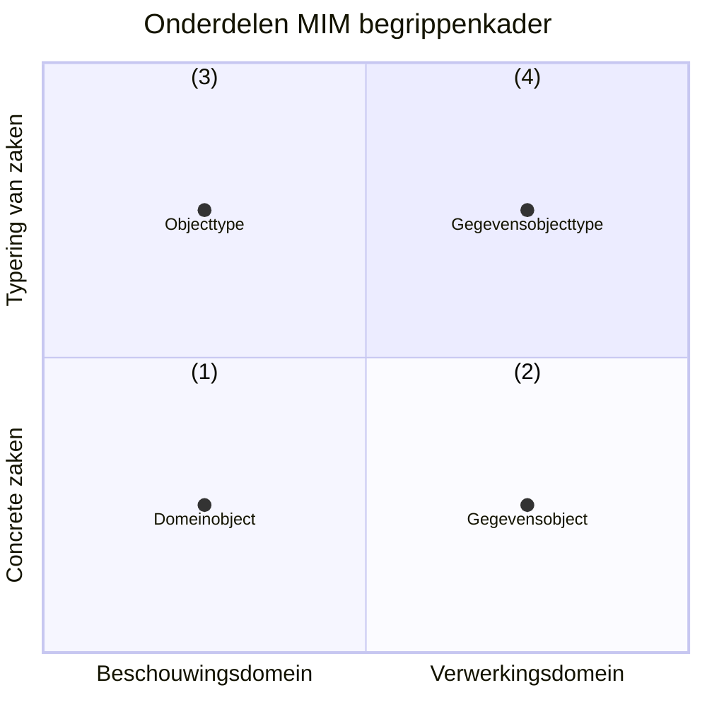

# MIM Metamodel begrippen

## Inleiding

Dit document beschrijft de begrippen die relevant zijn voor het MIM Metamodel. Gezamenlijk vormen deze begrippen de terminologie, de vocabulaire die voor MIM 2.0 gehanteerd wordt.

NB: Dit document bouwt het metamodel beetje-bij-beetje op, door steeds iets meer van het model prijs te geven. Voor degene die graag het eindresultaat wil zien (het volledige metamodel), kun je ook direct naar de metamodel navigeren, onderaan deze pagina.

De NL-SBB standaard is gebruikt bij het beschrijven van deze MIM 2.0 begrippen. Een belangrijk principe daarbij is het onderscheid tussen een «term», een «begrip» en de «definitie» van zo'n begrip:
- Een «term» is (slechts) een woord of aaneenschakelijk van woorden. De term is hetgeen we in een bepaalde context gebruiken om te verwijzen naar een specfiek begrip. Zo wordt de term "bank" gebruikt om te verwijzen naar het begrip «bank (financieel)», maar ook naar het begrip «bank (meubelstuk)».
- Een «begrip» is de gedachte, de notitie die we bedoelen als we een «term» gebruiken in een specifieke context. Oftwel: een «begrip» is een «term» met één betekenis. Als we (dus) dezelfde term gebruiken in twee verschillende contexten met hun eigen betekenis, dan hebben we het ook over twee verschillende begrippen. Andersom kun je twee termen gebruiken voor hetzelfde begrip: de «voorkeursterm» en de «alternatieve term».
- Een «definitie» is een formele tekstuele beschrijving van wat we bedoelen met een «begrip». Een «term» heeft (dus) nooit een definitie, maar een begrip wel. En de definitie moet onderscheidend en precies genoeg zijn om begrippen van elkaar te kunnen onderscheiden, zodat je weet wat er wel en niet onder dat begrip wordt verstaan.

Uitgangspunt bij dit metamodel van begrippen is dat dit metamodel betrekking heeft op zowel MIM niveau 2 als MIM niveau 3: al deze begrippen horen tot hetzelfde model, tot hetzelfde begrippenkader. Conform de NL-SBB betekent dit dat we nooit dezelfde term gebruiken voor twee verschillende begrippen: we hanteren voor elk (meta)begrip in dit metamodel unieke termen.

> Zo maken we (dus) ook onderscheid tussen «Objecttype» en «Gegevensobjecttype», omdat dit twee verschillende begrippen betreft, ondanks dat in MIM 1.2 beiden met hetzelfde stereotype konden worden aangeduid en alleen uit de context duidelijk was welk begrip je bedoelde: Objecttype in een CIM of Objecttype in een LGM. Bij het lezen van dit document zal duidelijk worden dat we de term "Objecttype" **alleen** gebruiken voor het CIM, MIM niveau 2.

### Beschouwingsdomein en verwerkingsdomein

Met gegevensmodelleren en gegevenstypering beschrijven we gegevens. Die gegevens *gaan* ergens over: bijvoorbeeld over mensen, gebeurtenissen, objecten, plaatsen en de relaties daartussen. Andersom gaan mensen ook *over* gegevens: zij geven betekenis aan gegevens, bijvoorbeeld door beslissingen af te laten hangen van de gegevens die zij tot hun beschikking hebben of door in formele documenten afspraken op te schrijven welke betekenis we met bepaalde gegevens beogen. Om nauwkeurig gegevens te kunnen typeren, zullen we het over deze betekenis moeten hebben. En daarvoor is het van belang om bepaalde zaken van elkaar te onderscheiden.

Enerzijds kunnen we het hebben over het domein *waarover* we gegevens willen verwerken. En anderzijds kunnen we het over de gegevens (en de verwerking daarvan) *zelf* hebben. En dit zijn verschillende zaken! Eerstgenoemde domein zullen we het «*beschouwingsdomein*» noemen, laatstgenoemde het «*verwerkingsdomein*».

<aside class="note" title="Rationale">
Het «beschouwingsdomein» wordt in de Engelse literatuur ook wel "Universe of Discourse" genoemd. In het Nederlands hebben we het ook wel eens over "de business". We hebben gekozen voor de term "beschouwingsdomein" om expliciet te maken dat het ons gaat om datgeen we beschouwen. In MIM 1.2 wordt ook wel gesproken over "de werkelijkheid". Die term vinden we ongelukkig omdat hiermee onduidelijk blijft wat dan precies die werkelijkheid is. Zo bestaan veel juridische dingen niet in de waarneembare werkelijkheid, maar zijn dat wel dingen die we willen beschouwen. Ook doet de term "werkelijkheid" geen recht aan het feit dat je in verschillende contexten anders tegen de werkelijkheid aan wilt kijken. Met de term "beschouwingsdomein" maken we duidelijk dat *hoe* je beschouwt ook van belang is.

De term "verwerkingsdomein" is om vergelijkbare redenen gekozen. We kijken hier bewust naar het domein waarin de verwerking plaats vindt, niet het domein dat we beschouwen *bij* die verwerking. Ook is bewust gekozen om het woord "gegevens" niet op te nemen (waarmee je zou kunnen komen tot woorden als "gegevensdomein" of "gegevensverwerkingsdomein"). De reden daarvoor is dat we ons in het verwerkingsdomein op voorhand niet willen beperken tot gegevens. Ook regels en processen zou je kunnen beschrijven met betrekking tot het verwerkingsdomein.
</aside>

We gebruiken hier steeds het begrip «verwerken». We hebben het dan ook over zowel het lezen, gebruiken, uitwisselen, opslaan, wijzigen, duurzaam bewaren als vernietigen van gegevens.

Aangezien gegevens over de dingen in het beschouwingsdomein gaan, zullen we die dingen moeten kunnen herkennen. Dit lijkt vaak makkelijk, maar dat is het niet. Zo is het relatief makkelijk om te bepalen wie een mens is en wie niet. Maar als het om meer abstracte zaken gaat (wanneer ben je Belastingplichtige, Verdachte of Eigenaar?), dan wordt het moeilijk. En als we dingen niet alleen willen herkennen (antwoord op de vraag: "is het er zo eentje?"), maar ook identificeren (antwoord op de vraag: "is het die ene?"), dan wordt het nog een stuk minder makkelijk. Modelleren is een hulpmiddel om deze complexiteit behapbaar te maken.

### Soorten modellen

We modelleren zowel het beschouwingsdomein als het verwerkingsdomein. En het is daarbij verstandig om niet alles in één model te willen stoppen: hierdoor wordt het model te complex en niet meer te begrijpen. Modelleren is juist een werkwijze om te komen tot een eenduidige beschrijving met precies voldoende detail voor optimaal begrip. Oftewel: "*Ik kan wel (heel) precies zijn, maar dan wordt ik niet begrepen. Als ik begrepen wil worden, kan ik niet (te) precies zijn*"). Deze eenduidige werkwijze is afgestemd op het doel dat we willen bereiken met het model. We onderscheiden vijf verschillende doelen, en evenzoveel soorten modellen:

1. **Kennisbronnen** en **verhalen**. Beiden zijn voor mensen leesbare en begrijpbare beschrijvingen in natuurlijke taal van de kennis over het beschouwingsdomein. Uit deze kennisbronnen en verhalen kan de betekenis worden gevonden, in de zin van: "de betekenis is, zoals beoogd in dit document". Zo'n kennisbron legitimeert de beoogde betekenis, bijvoorbeeld een wet of een standaard waar we ons aan willen houden. Maar ook verhalen kunnen helpen: ze nemen de lezer mee in de betekenis vanuit voorbeelden en concrete gebeurtenissen.
2. **Model van begrippen**. Een eerste, talig, model van begrippen helpt om een beter inzicht te krijgen wat er wordt bedoeld als een bepaald woord of woordcombinatie ("term") wordt gebruikt in het beschouwingsdomein. We modelleren hier het begrip dat we hebben als we met elkaar communiceren: welke woorden *daadwerkelijk* worden gebruikt in het beschouwingsdomein en wat ze in die context betekenen voor degenen die deze woorden gebruiken. Dergelijke woorden kunnen duiding geven aan een subject of object in het beschouwde domein ("werknemer", "woning") en ook aan afspraken of verplichtingen die in het beschouwingsdomein gelden ("arbeidscontract", "eigendom" of "belastingplicht").
3. **Conceptueel model**, waarmee inzicht wordt gegeven welke dingen (zoals: objecten, actoren en handelingen) relevant zijn om te beschouwen en welke eigenschappen daarvan en relaties daartussen. Anders dan bij een model van begrippen, gaat het ons hier niet primair om de gebruikte taal, maar juist de dingen waarover wordt gesproken (letterlijk: "de onderwerpen van gesprek"). Het gaat ons om het *ontologisch commitment* dat we aangaan met betrekking tot het beschouwingsdomein. Ook gaat het in een dergelijk model over de regels die gelden met betrekking tot de beschreven handelingen. Zo kan ook onderscheid gemaakt worden in een conceptueel informatiemodel (dat zich richt op de relevante informatie), conceptueel regelmodel (dat zich op de relevante regels) en een conceptueel procesmodel (dat zich richt op de relevante processen)
4. **Logisch gegevensmodel**. Waar we in de vorige modellen kijken naar het beschouwingsdomein waarover we gegevens willen verwerken, kijken we in dit model juist naar die gegevens zelf. Het logisch gegevensmodel is een model van het verwerkingsdomein. Het logisch gegevensmodel is **geen** model van het beschouwingsdomein, hoewel de modellen veel op elkaar kunnen leiden (dit wordt isomorfie genoemd, hierover later meer). Ook kunnen we bij het logisch gegevensmodel een nader onderscheid maken tussen modellen van administraties (hoe gegevens worden opgeslagen), modellen van interacties (hoe gegevens worden uitgewisseld) en modellen van de verwerking binnen een proces (hoe gegevens worden verwerkt). Het uitdrukking geven aan de gegevensverwerkende processen en op gegevens van toepassing zijnde regels zie we dan ook nadrukkelijk als onderdeel van een logisch gegevensmodel. Zo kun je ook een logisch regelmodel en een (logisch) procesmodel opstellen en onderling naar elkaar verwijzen.
5. **Fysiek datamodel**. Tenslotte zullen gegevens ook daadwerkelijk vastgelegd, uitgewisseld of bewerkt moeten worden. Het fysieke datamodel beschrijft hoe gegevens als data worden vastgelegd, uitgewisseld of bewerkt.

Van modelsoort (1) naar modelsoort (5) is sprake van een steeds concreter beeld van wat we bedoelen, het wordt steeds preciezer. Toch is ook het fysiek datamodel slechts een model van de data: het beschrijft niet de data zelf, maar het "model", de "mal" waarbinnen deze data moet vallen. Daarnaast geldt dat er niet alleen een afhankelijkheid is van (1) naar (5), ook andersom is sprake van een afhankelijkheid: zo kun je het nooit over bepaalde zaken hebben, als je daarover geen gegevens uitwisselt.

In dit document zullen we ons met name richten op het conceptueel informatie model en het logisch gegevensmodel. De samenhang met de overige soorten modellen valt voorlopig buiten de scope van dit document.

### Gebruik van quotes

We introduceren in dit document bepaalde begrippen en gebruiken daar bepaalde termen voor. Daarbij is het soms van belang om expliciet te maken dat we een begrip bedoelen en soms expliciet van belang dat we een term bedoelen. De term "drie" heeft 4 letters, terwijl het begrip «drie» de betekenis heeft van het getal 3. Waar we verwijzen naar een term gebruiken we daarvoor aanhalingstekens, waar we verwijzen naar een begrip gebruiken we [guillemets](https://nl.wikipedia.org/wiki/Guillemet), zoals in het voorbeeld in deze paragraaf. In de lopende tekst zullen we ook definities voor dergelijke begrippen geven. Daar gebruiken we HOOFDLETTERS om aan te geven dat we een begrip bedoelen dat we ook definiëren in dit stuk. In voorbeelden verwijzen we vaak naar concrete dingen in het beschouwingsdomein. Als we het over [Jan] hebben, dan bedoelen we niet het woord "Jan" of het begrip «Jan», maar met [Jan] verwijzen we naar een concreet aanwijsbaar persoon die bekend is onder de naam "Jan". In dergelijke gevallen gebruiken we blokhaken.

## Een voorbeeld - het beschouwingsdomein

Voor dit document gebruiken we een voorbeeld, een casus op basis waarvan we de overige modellen zullen invullen.

> - [Jan] is geboren op 10 februari 1970 in [Zwolle].
> - [Jan] is de zoon van [Paul] en [Marie Veenstra].
> - [Jan] heeft inmiddels een lengte van 2 meter en 5 centimeter bereikt.
> - En hoewel [Jan] oorspronkelijk gezegend was met een flinke bos haar, is [Jan] inmiddels vrijwel volledig kaal.
> - [Jan] werkt sinds 1990 als «bakker» bij [Bakkerij Broodjes].
> - [Jan] woont inmiddels in [Meppel]. [Jan] is in [Meppel] ingeschreven met BSN nummer "12345678".
> - [Jan] is getrouwd met [Marie] op 6 september 2003.

**TODO: Voorbeeld nog verder uitwerken. Liefst ook met een stukje wet- en regelgeving, bijvoorbeeld arbeidsrecht**

## De opzet van dit begrippenkader

Onderstaand figuur laat concreet zien hoe we dit begrippenkader opstellen. We onderscheiden vier onderdelen:

1. De concrete zaken uit het beschouwingsdomein. Hierbij gaat het om de begrippen die we gebruiken om de onderwerpen van gesprek te benoemen die concreet in het beschouwingsdomein bestaan. Een voorbeeld is het begrip «domeinobject»;
2. De concrete zaken uit het verwerkingsdomein. Hierbij gaat het om de begrippen die we gebruiken om de onderwerpen van gesprek te benoemen die concreet in het verwerkingsdomein bestaan. Een voorbeeld is het begrip «gegevensobject»;
3. De typering van zaken uit het beschouwingsdomein. Hierbij gaat het om de begrippen die we gebruiken om de elementen te benoemen die in modellen van het beschouwingsdomein te vinden zijn. Een voorbeeld is het begrip «objecttype»;
4. De typering van zaken uit het verwerkingsdomein. Hierbij gaat het om de begrippen die we gebruiken om de elementen te benoemen die in modellen van het verwerkingsdomein te vinden zijn. Een voorbeeld is het begrip «gegevensobjecttype».

<figure id="Mermaidvoorbeeld">

</figure>

## De concrete zaken uit het beschouwingsdomein

De termen "beschouwingsdomein" "beschouwde domein" en "domein" kunnen in dit document als synoniem van elkaar worden gelezen met de volgende betekenis:

> Een BESCHOUWINGDOMEIN is een deel van de waarneembare en/of sociale werkelijkheid dat we relevant vinden om te beschouwen vanuit een bepaalde context

Belangrijke kenmerken van het beschouwingsdomein zijn:

- Het beperkt zich niet tot datgeen we waar kunnen nemen, maar kan alles omvatten dat "we" als waar, als werkelijk zien;
- Het veronderstelt niet dat "de" werkelijkheid bestaat, maar dat je er vanuit een bepaalde invalshoek, een bepaalde context naar kunt kijken;
- Het beperkt zicht tot het deel dat we relevant vinden om te beschouwen, dus zeker niet alles.

### De basis: domeinobjecten en eigenschappen

> Een DOMEINOBJECT is een onderscheidbaar iets in het beschouwde domein

Wat we onderscheiden in een domein, en wat (dus) hier een object is, hangt af van wat we willen beschouwen. Deze keuzes over wat we willen onderscheiden leggen we vast in een conceptueel model. Een conceptueel model is, met andere woorden, een model van domeinobjecten. Domeinobjecten kunnen zowel fysiek waarneembaar zijn, zoals een gebouw of voertuig, maar ook virtueel zoals een giraal geld of het eigendom van een perceel. Ook hoeven domeinobjecten niet werkelijk te bestaan. Zo kun je het Star Wars domein beschouwen en vanuit dat beschouwingsdomein gezien, "bestaan" zaken als light sabers en death stars.

We gebruiken hier bewust het woord "domeinobject" om expliciet te maken dat we het over de objecten hebben die we beschouwen in een domein. Alles kan immers een object zijn, afhankelijk van wat je beschouwt. Zo hebben java-programmeurs het ook over objecten, maar dan bedoelen ze de java-objecten in hun programmeertaal (want dat is dan hetgeen ze beschouwen!). Verderop in dit document zullen we het hebben over gegevensobjecten. En dan bedoelen we dus ook weer die objecten die we beschouwen als we het over het gegevens hebben, dwz: zoals ze voorkomen in het verwerkingsdomein.

<aside class="note" title="Verdieping">
Stel dat we een conceptueel model zouden maken van de Java programmeertaal. Het beschouwingsdomein is dan (dus) de Java programmeertaal. En de domeinobjecten zijn dan (dus) onder meer de Java-objecten (en classes, interfaces, functions, etc). Op diezelfde manier kunnen we <i>ook</i> een conceptueel model maken van de gegevensverwerking. De domeinobjecten zijn dan (dus) onder meer de gegevensobjecten. Vaak worden dergelijke modellen ook wel <i>meta</i>modellen genoemd, omdat we de gegevensverwerking zelf beschouwen, dwz: een model-van-een-model, en gegevens-over-gegevens.
</aside>

> Een EIGENSCHAP is een verschijnsel dat toegekend kan worden aan bepaalde DOMEIN OBJECTen.

Als je het over een bepaald domein object hebt (bijvoorbeeld [Jan]), dan kun je het over bepaalde eigenschappen van Jan hebben. Zoals het feit dat Jan een bepaalde lengte heeft, of getrouwd is, of ergens werkt. Dit zijn eigenschappen van Jan, verschijnselen die we aan hem kunnen toekennen.

De definities van «domeinobject» en «eigenschap» zijn niet heel precies. Er kan van alles onder vallen. Dat is bewust: we willen immers zo'n beetje alles kunnen beschouwen wat we relevant vinden *om* te beschouwen. Toch is er uit de definities wel het één en ander te halen:

1. Een domeinobject is onderscheidbaar. Dit houdt in dat je over iets in het beschouwingsdomein kunt zeggen dat het er eentje is (en niet twee), dat het er zo-eentje is (en niet iets anders) en dat het die ene is (en niet een andere).
2. Een domeinobject is iets in het beschouwde domein. Dit houdt in dat wat je onderscheid, bepaald wordt door het domein **en** hoe je dit domein wilt beschouwen. In verschillende domeinen of vanuit verschillende invalshoeken kun je dus ook andere dingen (willen) onderscheiden. We stellen hier ook dat DE werkelijkheid niet bestaat, maar dat je er altijd met een bepaalde blik naar kijkt: jouw invalshoek op het beschouwde domein.
3. Een eigenschap is typisch voor bepaalde objecten in het domein. Dus bepaalde domeinobjecten *hebben* zo'n eigenschap. Zo'n eigenschap is overigens niet voorbehouden aan een bepaalde groep van domeinobjecten. Zo kan de eigenschap «haarkleur» een eigenschap zijn van zowel (het haar van een voorkomen van) een mens, een konijn of zelfs een knuffelbeertje. We stellen hiermee alleen dat die objecten iets gemeen hebben: een haarkleur.
4. Wat een eigenschap is, is ook domeinspecifiek. In het vorige voorbeeld zou je ook kunnen stellen dat mensen, konijnen en knuffelbeertjes geen «haarkleur» hebben, maar dat «haarkleur» een eigenschap is van «haar», en dat een eigenschap van mensen, konijnen en knuffelbeertjes is dat ze «haar» kunnen hebben. Dat laatste is net wat preciezer, maar mogelijk niet relevant in jouw domein. Andersom kan het ook zijn dat we het juist (alleen) relevant vinden wie de eigenschap «rood haar» heeft. Als we dat domein beschouwen, dan kennen we alleen de eigenschap «rood haar», en kunnen we wel objecten onderscheiden in objecten die rood haar hebben, en de objecten die dat niet hebben. In dit domein kunnen we dan niet de objecten kunnen onderscheiden met een andere haarkleur.

## Identificerende eigenschap

Als we het over objecten in de fysieke werkelijkheid hebben, dan kunnen we die objecten aanwijzen. Zoals in de zin: "Hij daar, is de eigenaar". Stel dat die zin wordt uitgesproken in de winkel van Bakkerij Broodjes en er staan 5 mannen in die winkel, je zult dan de juiste persoon moeten aanwijzen! Je kunt ook gebruik maken van eigenschappen die de juiste persoon identificeren, zoals in de zin: "Die lange man met rood haar daar, is Jan, de eigenaar". We willen het ook vaak kunnen hebben over objecten die we niet kunnen aanwijzen, maar wel willen kunnen identificeren. Bijvoorbeeld het huwelijk tussen [Jan] en [Marie]. Ook dan hebben we eigenschappen van dat huwelijk nodig om het juiste huwelijk te kunnen identificeren.

> Een IDENTIFICERENDE EIGENSCHAP is een EIGENSCHAP waarmee de identiteit van een DOMEINOBJECT kan worden vastgesteld

Eén enkele identificerende eigenschap is vaak niet voldoende. Zo is in ons voorbeeld het niet voldoende om Jan daadwerkelijk uniek te kunnen identificeren. Daarvoor is vaak iets extra nodig, een eigenschap die wordt toegekend aan een object, om deze uniek te identificeren. Zo'n eigenschap is vaak niet rechtstreeks met het object verbonden, maar wordt erbij gehouden. De enige manier om zo'n toekende eigenschap daadwerkelijk aan het object te verbinden is door het er letterlijk op te plakken. Bijvoorbeeld een serienummer dat gegraveerd wordt in het chassis van een voertuig of een straatnaambordje dat langs een weg wordt geplaatst.

Veel identificerende eigenschappen zijn, goed beschouwd, vaak geen eigenschap van het object dat zij identificeren. Zo is een eigenschap van een motorvoertuig bijvoorbeeld dat het een motor heeft, wielen heeft, een kleur, een maximum snelheid, etc. Maar het kenteken van een motorvoertuig is geen echte eigenschap van dat motorvoertuig. Het is niet echt een **eigen**schap. Dit noemen we toegekende (identificerende) eigenschappen. Het zijn eigenschappen waarvan we vinden dat ze echt wel *van* het object zijn, maar feitelijk zijn ze toegekend. Het kenteken van een motorvoertuig is zo'n eigenschap.

> Een TOEGEKENDE IDENTIFICERENDE EIGENSCHAP is een IDENTIFICERENDE EIGENSCHAP die met dat doel is toegekend aan een DOMEINOBJECT

Om expliciet aan te geven dat een eigenschap niet is toegekend, maar dat we vinden dat deze daadwerkelijk **eigen** is aan een object, kunnen we de term "intrinsieke eigenschap" gebruiken.

Merk op dat wat we intrinsiek vinden en wat we toegekend vinden vooral een domeinaangelegenheid is: het is maar net hoe je er naar kijkt. Dat is dan ook precies wat we in een conceptueel model aan het doen zijn. Zo kun je stellen dat de naam van een persoon een intrinsieke eigenschap is, maar feitelijk is ook die maar toegekend ("en we noemen haar..."). En ook van het geslacht van een persoon kun je stellen dat dit een intrinsieke eigenschap is, maar er zijn ook beschouwingsdomeinen waar dit eerder als een toegekende eigenschap wordt gezien. Van belang is dus meer *of* er in het beschouwde domein sprake is van een eigenschap van een domeinobject, en niet zozeer of dit een intrinsieke dan wel toegekende is.

## Kenmerken, classificaties en rollen

### Kenmerken en waarden

Als we naar de eigenschappen van een domeinobject kijken, dan valt op dat er verschillende soorten eigenschappen zijn te onderkennen. Een eigenschap van een domeinobject kent één of meerdere invullingen. Zo is de invulling van de eigenschap «(heeft) lengte» van het domeinobject [Jan] uit ons voorbeeld gelijk aan "2 meter en 5 centimeter". En de invulling van de eigenschap «(heeft) werkgever» is [Bakkerij Broodjes]. Tenslotte is de invulling van de eigenschap «(heeft) geslacht» gelijk aan «man». Drie eigenschappen, maar geheel andere invullingen. We hebben het respectievelijk over een kenmerk, rol en classificatie. De nauwlettende lezer ziet dat we bij deze drie eigenschappen ook steeds een ander leesteken gebruiken!

> Een KENMERK is een EIGENSCHAP van een DOMEINOBJECT waar een WAARDE aan kan worden toegekend

> Een LETTERLIJKE WAARDE is een WAARDE waarvan de betekenis letterlijk genomen moet worden, de waarde zelf en niets meer

Een kenmerk is een eigenschap waar "slechts" een letterlijk waarde aan kan worden toegekend. Zoals «leeftijd» in het voorgaande voorbeeld. Een letterlijke waarde is geen object, maar juist een letterlijke invulling van de eigenschap. De betekenis van de letterlijke waarde is niets anders dan de letterlijke waarde zelf. Zoals een getal, een stukje tekst, een datum of een boolean (waar/onwaar). Zo is in ons voorbeeld «(heeft) leeftijd» een eigenschap van [Jan]. De *invulling* van dit kenmerk is bijvoorbeeld de waarde, het getal 25. En ook de eigenschap «(heeft) naam» van [Jan] is een kenmerk, met de waarde "Jan" (een woord bestaande uit drie letters).

<aside class="note" title="Verdieping">
Strikt genomen wordt aan een kenmerk toch vaak net wat meer toegekend dan een letterlijke waarde. De waarde "2 meter en 5 centimeter" is toch echt wat anders dan de waarde "2 feet and 5 inch". In de waarde zitten begrippen verscholen: «meter», «centimeter», «feet» en «inch». Dit zou je kunnen oplossen door niet te spreken van de eigenschap «lengte», maar van de eigenschap «lengte in centimeters». De begrippen verschuiven dan naar de eigenschap, en de waarde is weer zuiver letterlijk. Verderop in dit document zullen we zien dat het soms praktisch kan zijn om dergelijke eenheden (en ook grootheden) vanuit een waarde te typeren.
</aside>

<aside class="note" title="Verdieping">
Merk op dat we met deze definitie van kenmerk nog niets zeggen over het aantal keer dat een kenmerk kan worden ingevuld voor een domeinobject. Zo kan [Jan] wel drie voornamen hebben, dus er zijn dan drie invullingen van het kenmerk «naam».
</aside>

### Rollen en relaties

> Een ROL is een EIGENSCHAP van een DOMEINOBJECT in een RELATIE met zichzelf of een ander DOMEINOBJECT

Objecten kunnen zich verhouden tot andere objecten en dat kunnen wezenlijke eigenschappen zijn van zo'n object. Zo is een werkgever een rol van een persoon in een arbeidsrelatie met een andere persoon. Net zo goed als je kunt vragen "Wat is de leeftijd van Jan" (een vraag over de eigenschap «leeftijd» van een persoon) kun je de vraag stellen "Wie is de werkgever van Jan". De rol van werkgever wordt hier bijvoorbeeld vervuld door [Bakkerij Broodjes]. En [Jan] zelf vervult de rol van werknemer. In dit geval is «(heeft) werkgever» dus een eigenschap van [Jan]. De *invulling* van die rol ligt bij [Bakkerij Broodjes].

We bedoelen hier dus echt de [Bakkerij Broodjes] *zelf*. Dit is wezenlijk anders dan de eigenschap «naam» van die bakkerij. Als we zouden zeggen: "De werknemer van Jan is 'Bakkerij broodjes'", dan lijkt het alsof de werknemer van [Jan] een naam is die bestaat uit twee woorden (!). Van een dergelijk verschil tussen waarden en objecten wordt gebruik gemaakt in de grap: "Hoeveel is '1' plus '1'?" (antwoord: "11"). in bovenstaande zin wordt met de aanduiding [Bakkerij Broodjes] (dus) verwezen naar de Bakkerij zelf en niet naar de naam van de Bakkerij.

> Een RELATIE is een verbintenis tussen DOMEINOBJECTen

De introductie van het begrip «rol» vereist ook dat we het moeten hebben over het begrip «relatie». Een rol kan namelijk niet bestaan als eigenschap van een domeinobject zonder de relatie. Dit is anders dan bij een kenmerk. Voor een kenmerk is alleen maar nodig dat je weet over welk domeinobject het gaat, maar bij een rol heb je ook de relatie nodig. Een relatie lijkt op een domeinobject. Net als bij een domeinobject kan een relatie zelf ook eigenschappen hebben. Het verschil met een domeinobject is dat een relatie altijd afhankelijk is in zijn bestaan van andere domeinobjecten. In bovenstaand voorbeeld is de arbeidsrelatie tussen Jan en Bakkerij Broodjes een voorbeeld van een relatie. In deze specifieke relatie ligt de *invulling* van de rol werkgever bij [Bakkerij Broodjes] en de *invulling* van de rol werknemer bij [Jan]. Zonder deze twee invullingen, kan er ook geen sprake zijn van de betreffende relatie.

### Classificaties en klassen

> Een CLASSIFICATIE is een EIGENSCHAP van een DOMEINOBJECT waar een KLASSE aan kan worden toegekend

> Een KLASSE is een aanduiding van een groep DOMEINOBJECTen die iets gemeen hebben

Een classificatie zit tussen een kenmerk en een rol in. Het lijkt een beetje op een kenmerk, maar toch is een klasse geen waarde. En het lijkt een beetje op een rol, maar een klasse is geen object. Het zit er tussenin. Een klasse is een aanduiding voor een groep van objecten die iets gemeen hebben. Een classificatie verbindt een object met die klasse. Zou kun je bijvoorbeeld objecten groeperen die levende wezens zijn en waarvan de moeders de jongen melk geeft, dwz: de groep van zoogdieren. De klasse «zoogdier» kan dan de invulling zijn van de eigenschap «biologische klasse» van een levend wezen.

Er zijn eigenschappen die gaan over een onderscheid tussen objecten die onveranderlijk is. Zo zal de eigenschap «geboortedatum» van een persoon nooit veranderen: een persoon is nu eenmaal geboren op een bepaalde dag, dat zal niet meer veranderen. De eigenschap «leeftijd» verandert daarentegen elk jaar, maar wel op een hele reguliere manier (elk jaar eentje erbij). Er zijn ook eigenschappen die veranderen, zonder dat sprake is van vooraf duidelijke manier. Zo zijn rollen over het algemeen veranderlijk: [Jan] is (nu) werknemer van [Bakkerij Broodjes], maar mogelijk is hij dat over een tijdje niet meer, en er is ook een tijd geweest dat hij het (nog) niet was.

Ook voor classificaties geldt dit. Er zijn classificaties die onveranderlijk zijn. Zo zal een levend wezen altijd tot de klasse van zoogdieren behoren, of juist niet. De classificatie «werkeloos» is echt juist weer veranderlijk, en hangt bovendien ook samen met de rol «werknemer».

<aside class="note" title="Verdieping">
Je zult wellicht vinden dat een classificatie «werkeloos» een eigenschap is die je niet zou moeten modelleren in een conceptueel model. Vanuit de overtuiging dat de arbeidsrelatie de werkelijk juiste modellering is. Bedenk dan dat we een beschouwingsdomein aan het modelleren zijn. <i>Wat</i> we willen beschouwen, hangt van het domein af. Dus ook of we het interessant vinden om alle details te weten over de reden waarom iemand werkeloos is. Dat kan nuttig zijn, maar ook volledig overbodig. Daarom kan een dergelijke classificatie nuttig zijn. Een herkenbaar voorbeeld is dat je minimaal 18 jaar moet zijn om alcohol te mogen kopen. In dit beschouwingsdomein is de geboortedatum van een koper in het geheel niet relevant (en zelfs niet zijn of haar exacte leeftijd), slechts de classificatie «is minimaal 18 jaar» is relevant in dit domein.
</aside>

## De concrete zaken uit het verwerkingsdomein

Waar we het over "verwerkingsdomein" hebben, bedoelen we expliciet het domein van de gegevensverwerking, dat je ook het "gegevensdomein" of het "gegevensverwerkingsdomein" zou kunnen noemen met de volgende betekenis:

> Een VERWERKINGSDOMEIN is een deel van de waarneembare en/of sociale werkelijkheid waarin we gegevens verwerken over een specifiek beschouwingsdomein

Belangrijke kenmerken van het verwerkingsdomein zijn:

- Ook het verwerkingsdomein is een deel van de waarneembare en/of sociale werkelijkheid. Immers: als je gegevens vastlegd, dan is dat waarneembaar. Bij fysieke vastlegging op papier zelf tastbaar, maar ook bij digitale vastlegging is er sprake van waarneming!
- Het gaat ons hier om de verwerking van gegevens, waarbij we die gegevens zelf zien als de te verwerken eenheden;
- Het verwerkingsdomein is altijd verbonden aan een specifiek beschouwingsdomein waarover de gegevens gaan die we verwerken, het kan daar niet los van worden gezien.

### Gegevens

> Een GEGEVEN is een vastgelegde uitspraak over een EIGENSCHAP van een DOMEINOBJECT

Kenmerkend aan een gegeven zijn de volgende elementen:
1. Een gegeven is **vastgelegd**, op wat voor manier dan ook: van een kleitablet, papieren document tot een elektronisch bericht. En van een papieren register (boekhouding, teboekstelling) tot een digitale database. In elk van deze vormen van sprake zijn van meer of minder mate van vluchtigheid of persistentie: gegevens in een bericht zullen minder persistent zijn dan gegevens die duurzaam worden opgeslagen in een administratie.
2. Een gegeven is een **uitspraak**: zo'n uitspraak kan een bewering, stelling of waarneming zijn en zo'n uitspraak kan gedaan worden door een mens of een sensor. Ook kan zo'n uitspraak betrekking hebben op een berekening of afleiding. Een uitspraak hoeft ook niet waar te zijn, maar ze zijn in ieder geval *gedaan* door iets (bv een sensor, of een algoritme) of iemand (een daadwerkelijke persoon). Gegevens kunnen vastleggingen zijn van directe waarnemingen (een sensor die iets meet of een persoon die iets ziet), maar ook beweringen zijn op grond van afleidingen en beoordelingen (een algoritme dat een berekening uitvoert of een persoon die iets concludeert op basis van andere gegevens).
3. Een gegeven gaat over een **domeinobject**: het gaat over iets: de domeinobjecten die relevant zijn in het beschouwingsdomein waarover we gegevens verwerken.
4. Een gegeven betreft een **eigenschap** van dat object: het gegeven legt een uitspraak vast over een eigenschap die het object heeft. Dit kan zowel een kenmerk van het object zelf betreffen, als een relatie die een object heeft met een ander object. Bijvoorbeeld de eigenschap «geboortedatum» van de persoon [Jan] uit ons voorbeeld.

Hoewel gegevens gaan over de domeinobjecten en hun eigenschappen, is het niet direct mogelijk om de twee met elkaar te verbinden. Gegevens bestaan, zo gezegd, eigenlijk altijd in een andere werkelijkheid dan domeinobjecten. Denk bijvoorbeeld aan een domeinobject als een persoon, of een voertuig of een weg. Van alle drie kun je gegevens vastleggen. Maar om daarbij de relatie te leggen *waarover* deze gegevens gaan, zitten we met een probleem. De enige manier om gegevens en domeinobjecten direct aan elkaar te relateren is letterlijk de gegevens op het domeinobject te "plakken", of (net zo letterlijk): het domeinobject te "oormerken" (!). In onze huidige, digitale, samenleving is dit een uitzondering. We hebben "in" de werkelijkheid van de gegevens iets nodig om te kunnen verwijzen naar de betreffende persoon, voertuig of weg. We moeten ze identificeren. Vaak gebruiken we een toegekende identificerende eigenschap om bij een gegeven aan te kunnen geven over welk domeinobject het gaat.

In ons voorbeeld kunnen we bijvoorbeeld het volgende gegeven uitdrukken, door gebruik te maken van de toegekende identificerende eigenschap «BSN»: "De persoon met BSN 12345678 heeft geboortedatum 10 februari 1970". Dit gegeven is een bewering over de eigenschap «geboortedatum» van het domeinobject dat geïdentificeerd kan worden met de toegekende identificerende eigenschap «BSN» met de waarde "12345678", dwz: onze [Jan].

NB: Van belang in bovenstaande definitie is dat een gegeven afhankelijk is van de de domeinobjecten en eigenschappen die wilt onderkennen! Zonder inzicht in de domeinobjecten en hun eigenschappen, kun je er ook geen gegevens over vastleggen.

> Een GEGEVENSGROEP is een groepering van GEGEVENs

Een gegevensgroep is simpelweg het groeperen van enkele gegevens die we op een bepaalde manier bij elkaar vinden horen. Dus bijvoorbeeld een lijstje van geboortedata van personen (we groeperen dan op die eigenschap), of enkele gegevens over hetzelfde domeinobject, bijvoorbeeld onze [Jan].

> Een GEGEVENSOBJECT is een onderscheidbaar geheel van GEGEVENs over één of meerdere DOMEINOBJECTen

Als we een groep van gegevens als een geheel willen beschouwen, dus als een eigen aanwijsbaar object met een eigen identiteit, een geheel, dan hebben we het over een gegevensobject. Zo'n object kan gegevens omvatten die gaan over precies één domeinobject (het onderwerp van het gegevensobject), maar ook over meerdere domeinobjecten. De definitie van gegevensobject lijkt sterk op die van een domeinobject. Ook hier gaat het om een onderscheidbaar 'iets' in een domein, namelijk: het domein van de gegevensverwerking. En dat 'iets' is altijd een geheel van gegevens. Elk afzonderlijk gegeven gaat vervolgens over een domeinobject, waarmee het gegevensobject gaat over al deze domeinobjecten gezamenlijk. Als alle gegevens over hetzelfde domeinobject gaan, dan gaat ook het gegevensobject over precies dit ene domeinobject. Als een gegevensobject vooral gaat over één domeinobject, dan noemen we dat domeinobject het *hoofdonderwerp* van het gegevensobject.

> Een HOOFDONDERWERP is een DOMEINOBJECT waarover een GEGEVENSOBJECT in hoofdzaak gaat

Merk op: de identiteit van een gegevensobject is gerelateerd aan de identiteit van het hoofdonderwerp, maar verschilt. Zo kun je twee gegevensobjecten hebben die gaan over hetzelfde domeinobject, bijvoorbeeld één gegevensobject met de medische gegevens en één gegevensobject met (alleen) de naam-adres-woonplaats gegevens. Of één gegevensobject met de gegevens zoals deze op in 2015 geldig waren, en een ander gegevensobject met de gegevens zoals deze op 2016 geldig waren.

<aside class="note" title="Verdieping">

Een gegevensobject kun je *zelf* ook weer zien als een domeinobject. Dus het is niet zo maar een geheel van gegevens, het is een geheel van gegevens die onderscheidbaar zijn in een domein. En in dit geval is dit het verwerkingsdomein van gegevens. Meta-gegevens (gegevens *over* gegevens) kunnen zo ook worden uitgedrukt: een (meta)gegeven is daarmee een vastgelegd waarneming of bewering over een getypeerde eigenschap van een gegevensobject.

Merk op dat als we het hebben over gegevens-over-gegevens, we het over metagegevens hebben. Dergelijke metagegevens bestaan in dit geval *wel* in dezelfde werkelijkheid als de gegevens waarover ze gaan. Het is dan over het algemeen ook veel makkelijker om metagegevens en gegevens bij elkaar te plaatsen. Wel blijft van belang om te blijven erkennen dat het hier om twee verschillende objecten gaat. Onderstaand voorbeeld geeft dit weer:

<pre>
Een gegeven: "De persoon met BSN 12345678 heeft geboortedatum 10 februari 1970"
Een metagegeven: "Het gegeven: 'De persoon met BSN 12345678 heeft geboortedatum 10 februari 1970' bevat een foutieve waarde voor de eigenschap BSN"
</pre>

Het gegeven <i>gaat over</i> een persoon, het metagegeven <i>gaat over</i> een gegeven.

</aside>

### Gebruik van identificerende eigenschappen voor verwijzingen

Een eigenschap kan een kenmerk, rol of classificatie zijn. Een gegeven kan daarmee dus gaan over zowel kenmerken, rollen en classificaties. Daarbij is duidelijk dat als je het over een eigenschap van een domeinobject hebt, je dit domeinobject zelf moet identificeren. Hiervoor hebben we de identificerende eigenschappen van een domeinobject gebruikt.

Een gegeven dat gaat over een kenmerk, kunnen we direct de waarde van dat kenmerk zelf gebruiken, zoals in het gegeven uit bovenstaand voorbeeld: "10 februari 1970" was de waarde van het kenmerk waarover dit gegeven gaat. De waarde zelf kan letterlijk gebruikt worden in het gegeven, er is geen verschil tussen de manier waarop aan de waarde *refereren* en wat de waarde *betekent*. Dit gaat niet op voor rollen en classificaties.

Bij een rol is de invulling van de rol geen waarde, maar een (ander) domeinobject. Ook daar zullen we (dus) weer gebruik moeten maken van de identificerende eigenschappen van dit domeinobject, zoals in het gegeven: "De persoon met BSN 12345678 is werknemer van het bedrijf met RSIN 87654321". Met dit gegeven wordt overigens hetzelfde bedoeld als met het gegeven "De persoon met de naam Jan is werknemer van het bedrijf met de naam Bakkerij Broodjes". Laatstgenoemde vorm is echter niet zo precies, aangezien het maar de vraag is of de eigenschap «naam» voldoende identificerend is.

Daarnaast zie je bij relaties en rollen dat je hetzelfde gegeven in drie verschillende vormen kunt uitdrukken, met elk dezelfde betekenis:

<pre>
1. "De persoon met BSN 12345678 is werknemer van het bedrijf met RSIN 87654321"
2. "De persoon met BSN 12345678 heeft werkgever het bedrijf met RSIN 87654321"
3. "Het bedrijf met RSIN 87654321 heeft werknemer de persoon met BSN 12345678"
</pre>

Bij een classificatie is de invulling van een classificatie geen waarde, maar een klasse. We kunnen de letterlijke aanduiding van die klasse niet gebruiken in het gegeven, we zullen moeten verwijzen door gebruik te maken van een identificerende eigenschap van die klasse.

### Wat voorbeelden

Nu we de begrippen rondom gegevens helder hebben, kunnen we een aantal voorbeelden van gegevens geven. We kunnen het zo over de volgende gegevens hebben:

- Er is een domeinobject met de voornaam "Jan" (de invulling voor de eigenschap «voornaam» van dit domeinobject is de waarde "Jan");
- Dit domeinobject heeft BSN 12345678 (de invulling voor de toegekende identificerende eigenschap «BSN» van dit domeinobject is de waarde "12345678");
- Dit domeinobject heeft als geboortedatum 25 mei 1970 (de invulling voor de eigenschap «geboortedatum» van dit domeinobject is de waarde "25 mei 1970");
- Dit domeinobject is een man (de invulling voor de classificatie-eigenschap «geslacht» is de klasse «mannelijk»);
- Dit domeinobject is de werknemer van een domeinobject met de naam "Bakkerij Broodjes" (de invulling voor de rol werkgever van [Jan] is [Bakkerij Broodjes]).
- Dit domeinobject is getrouwd met een domeinobject met de naam "Marie" (de invulling van de rol partner van [Jan] is [Marie]).

Deze zes uitspraken zijn zes gegevens die gegroepeerd kunnen worden tot één gegevensobject met als hoofdonderwerp het domeinobject met het BSN 12345678.

### Rol, rolinvulling en relatie-domeinobject

In onze kijk op het domein hebben we het slechts over objecten en eigenschappen van objecten gehad. En hoewel we relaties hebben besproken, komt relatie niet terug in ons voorbeeld. Alleen de rol komt terug.

In onze kijk op het beschouwingsdomein hebben we het over domeinobjecten gehad die eigenschappen kunnen hebben en waarbij sprake kan zijn van relaties tussen domeinobjecten. En hoewel we het kunnen hebben over een relatie (zoals de "arbeidsrelatie"), zagen we die relatie niet als "bijzonder" genoeg om deze daadwerkelijk te identificeren. Maar dat hoeft niet: dit hangt sterk af van hoe we tegen het domein aan willen kijken.

Als we de relatie *zelf* willen onderkennen, dan kunnen we de relatie simpelweg als een domeinobject beschouwen.

Zo kunnen we het bijvoorbeeld over de huwelijksrelatie tussen Jan en Marie hebben. Zo'n huwelijksrelatie betreft dan een (relatie)domeinobject. Het relatiedomeinobject heeft dan zelf eigenschappen, zoals de huwelijksdatum, de gehuwden en getuigen. En we zullen zo'n relatiedomeinobject moeten kunnen identificeren. In dit geval zou de combinatie van de identificerende eigenschappen van de huwelijkspartners en de huwelijksdatum daarvoor bruikbaar zijn. Het is echter ook denkbaar dat in het betreffende domein een afzonderlijk huwelijkskenmerk bestaat, bv het nummer van de huwelijksakte.

Relaties hebben vaak te maken met gebeurtenissen waaruit de relatie ontstaan. In bovenstaand voorbeeld stond de gebeurtenis centraal. Maar ook het resultaat van de gebeurtenis kan gezien worden als domeinobject. In zo'n geval zou huwelijk mogelijk een eigenschap «huwelijkse voorwaarden» hebben.

Bij het betalen van een rekening is zo sprake van de gebeurtenis van betalen, het resultaat van de betaling en de rollen betaler en ontvanger. Het is aan de modelleur om aan te geven welke onderdelen hij hiervan als domeinobjecten en eigenschappen wenst te zien in het beschouwingsdomein.

En ook de rol(invulling) zelf kunnen we zien als een domeinobject. Zo is een eigenschap van een betaling de rol «betaler». Als we naar de invulling van die rol kijken, dan wordt die ingevuld door een domeinobject dat we de «Betaler» kunnen noemen. Met andere woorden:

> Als Bakkerij Broodjes het loon van Jan overmaakt (4700 euro), dan:
> - Is er sprake van een betaling;
> - Een eigenschap van die betaling is het «bedrag»;
> - De invulling van deze eigenschap voor deze betaling is "4700 euro";
> - Een eigenschap van die betaling is de «betaler»;
> - De invulling van deze eigenschap voor deze betaling is [Bakkerij Broodjes]
> - [Bakkerij Broodjes] is in deze betaling de betaler.
