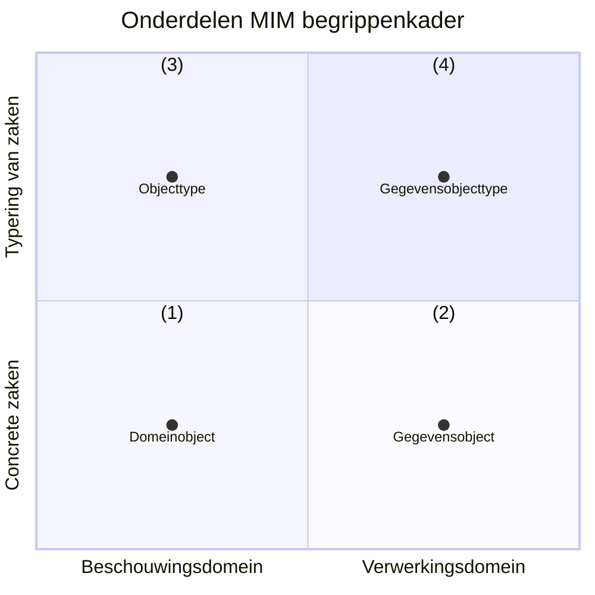

# Uitleg MIM Metamodel

## Inleiding

Dit document beschrijft de begrippen die relevant zijn voor het MIM Metamodel. Gezamenlijk vormen deze begrippen de terminologie, het vocabulaire die voor MIM 2.0 wordt gehanteerd.

NB: Dit document bouwt het metamodel van MIM-begrippen beetje-bij-beetje op, door steeds iets meer van het model prijs te geven. Het volledige begrippenkader in samenhang is hier te vinden: [MIM-begrippenkader](/mim-metamodel/metamodel-begrippen.html). Het volledige metamodel in grafische vorm is hier te vinden: [MIM-metamodel](/mim-metamodel/metamodel.html).

Voor het beschrijven van de MIM-begrippen is de NL-SBB standaard gebruikt. Een belangrijk principe daarbij is het onderscheid tussen een «term», een «begrip» en de «definitie» van zo'n begrip:
- Een «term» is (slechts) een woord of aaneenschakeling van woorden. De term is hetgeen we in een bepaalde context gebruiken om te verwijzen naar een specifiek begrip. Zo wordt de term "bank" gebruikt om te verwijzen naar het begrip «bank (financieel)», maar ook naar het begrip «bank (meubelstuk)».
- Een «begrip» is de gedachte, de notie die we bedoelen als we een «term» gebruiken in een specifieke context. Oftwel: een «begrip» is een «term» met één betekenis. Als we (dus) dezelfde term gebruiken in twee verschillende contexten met hun eigen betekenis, dan hebben we het ook over twee verschillende begrippen. Andersom kun je twee termen gebruiken voor hetzelfde begrip: de «voorkeursterm» en de «alternatieve term».
- Een «definitie» is een gestructureerde tekstuele beschrijving van wat we bedoelen met een «begrip». Een «term» heeft (dus) nooit een definitie, maar een begrip wel. Een definitie is ook niet zomaar een stukje uitleg over de betekenis van een begrip. Een definitie volgt bepaalde regels, kent een specifieke structuur. Zo moet de definitie onderscheidend en precies genoeg zijn om begrippen van elkaar te kunnen onderscheiden, zodat je weet wat er wel en niet onder dat begrip wordt verstaan.

Uitgangspunt bij dit metamodel van begrippen is dat dit metamodel betrekking heeft op zowel MIM niveau 2 als MIM niveau 3: al deze begrippen horen tot hetzelfde model, tot hetzelfde begrippenkader. Conform de NL-SBB betekent dit dat we nooit dezelfde term gebruiken voor twee verschillende begrippen: we hanteren voor elk (meta)begrip in dit metamodel unieke termen.

> Zo maken we (dus) ook onderscheid tussen «Objecttype» en «Gegevensobjecttype», omdat dit twee verschillende begrippen betreft. In de huidige versie van MIM kan hiervoor hetzelfde stereotype worden gebruikt: "objecttype". Uit de context is vervolgens duidelijk welk begrip wordt bedoeld: stereotype "objecttype" in een conceptueel informatiemodel (CIM) komt overeen met het begrip «Objecttype» en stereotype "objecttype" in een logisch gegevensmodel (LGM) komt overeen met het begrip «Gegevensobjecttype». Bij het lezen van dit document zal duidelijk worden dat we de term "Objecttype" **alleen** gebruiken voor het CIM, MIM niveau 2.

> [!NOTE]
> Dit document gaat slechts over het metamodel. Het doet daarmee geen uitspraken over of in een specifieke modelleertaal (UML, Linked Data, FBM, ER) de begrippen uit dit metamodel overgenomen moeten worden. Hoewel dit bij bepaalde modelleertalen (zoals bij Linked Data) voor de hand ligt, doet dit document hier geen uitspraken over.

### Beschouwingsdomein en verwerkingsdomein

Met gegevensmodelleren en gegevensduiding beschrijven we gegevens. Die gegevens *gaan* ergens over: bijvoorbeeld over personen, gebeurtenissen, objecten, plaatsen en de relaties daartussen. Mensen geven betekenis aan gegevens, bijvoorbeeld door beslissingen af te laten hangen van de gegevens die zij tot hun beschikking hebben of door in formele documenten afspraken op te schrijven welke betekenis we met bepaalde gegevens beogen. Om nauwkeurig gegevens te kunnen duiden, zullen we het over deze betekenis moeten hebben. En daarvoor is het van belang om bepaalde zaken van elkaar te onderscheiden.

Enerzijds kunnen we het hebben over het domein *waarover* we gegevens willen verwerken. En anderzijds kunnen we het over de gegevens (en de verwerking daarvan) *zelf* hebben. En dit zijn verschillende zaken! Eerstgenoemde domein zullen we het «*beschouwingsdomein*» noemen, laatstgenoemde het «*verwerkingsdomein*».

> [!NOTE]
> Het «beschouwingsdomein» wordt in de Engelse literatuur ook wel "Universe of Discourse" genoemd. We hebben gekozen voor de term "beschouwingsdomein" om expliciet te maken dat het ons gaat om hetgeen we beschouwen. Dat kan de waarneembare werkelijkheid zijn, maar ook niet-waarneembare zaken zoals juridische aspecten of sociale afspraken of zelfs fictieve zaken (als dat hetgeen is dat je zou willen beschouwen). Daarnaast kun je in verschillende contexten anders tegen de werkelijkheid aankijken. Met de term "beschouwingsdomein" maken we duidelijk dat *hoe* je beschouwt ook van belang is.
> De term "verwerkingsdomein" is om vergelijkbare redenen gekozen. We kijken hier bewust naar het domein waarin de verwerking plaats vindt, niet het domein dat we beschouwen *bij* die verwerking. Ook is bewust gekozen om het woord "gegevens" niet op te nemen (waarmee je zou kunnen komen tot woorden als "gegevensdomein" of "gegevensverwerkingsdomein"). De reden daarvoor is dat we ons in het verwerkingsdomein op voorhand niet willen beperken tot gegevens. Ook regels en processen zou je kunnen beschrijven met betrekking tot het verwerkingsdomein.

We gebruiken hier steeds het begrip «verwerken». We hebben het dan ook over zowel het lezen, gebruiken, uitwisselen, creëren, opslaan, wijzigen, duurzaam bewaren als vernietigen van gegevens.

Aangezien gegevens over de dingen in het beschouwingsdomein gaan, zullen we die dingen moeten kunnen herkennen. Dit lijkt vaak makkelijk, maar dat is het niet. Zo is het relatief makkelijk om te bepalen wie een mens is en wie niet. Maar als het om meer abstracte zaken gaat (wanneer ben je Belastingplichtige, Verdachte of Eigenaar?), dan wordt het moeilijk. En als we dingen niet alleen willen herkennen (antwoord op de vraag: "is het er zo eentje?"), maar ook identificeren (antwoord op de vraag: "is het die ene?"), dan wordt het nog een stuk moeilijker. Modelleren is een hulpmiddel om deze complexiteit behapbaar te maken.

### Soorten modellen

We modelleren zowel het beschouwingsdomein als het verwerkingsdomein. Met modelleren beschrijven we op een gestructureerde wijze een domein. En het is daarbij verstandig om niet alles in één model te willen stoppen: hierdoor wordt het model te complex en niet meer te begrijpen. Modelleren is juist een werkwijze om te komen tot een eenduidige representatie van het beschouwingsdomein dan wel verwerkingsdomein met precies voldoende detail voor optimaal begrip. Deze eenduidige werkwijze is afgestemd op het doel dat we willen bereiken met het model, wat we ermee wensen te representeren. We onderscheiden vijf verschillende doelen, en evenzoveel soorten representaties:

1. **Kennisbronnen** en **verhalen**. Beiden zijn voor mensen leesbare en begrijpbare vastgelegde beschrijvingen in natuurlijke taal van de kennis over het beschouwingsdomein. Uit deze kennisbronnen en verhalen kan de betekenis worden gevonden, in de zin van: "de betekenis is, zoals beoogd in dit document". Zo'n kennisbron legitimeert de beoogde betekenis, bijvoorbeeld een wet of een standaard waar we ons aan willen houden. Maar ook verhalen kunnen helpen: ze nemen de lezer mee in de betekenis vanuit voorbeelden en concrete gebeurtenissen.
2. **Model van begrippen**. Een eerste, talig, model van begrippen helpt om een beter inzicht te krijgen in wat er wordt bedoeld als een bepaald woord of woordcombinatie ("term") wordt gebruikt in het beschouwingsdomein. We modelleren hier het begrip dat we hebben als we met elkaar communiceren: welke woorden *daadwerkelijk* worden gebruikt in het beschouwingsdomein en wat ze in die context betekenen voor degenen die deze woorden gebruiken. Dergelijke woorden kunnen duiding geven aan een subject of object in de beschouwde werkelijkheid ("werknemer", "woning") en ook aan afspraken of verplichtingen die in het beschouwingsdomein gelden ("arbeidscontract", "eigendom" of "belastingplicht").
3. **Conceptueel informatiemodel**, waarmee inzicht wordt gegeven welke dingen (zoals: objecten, actoren en handelingen) relevant zijn om te beschouwen en welke eigenschappen daarvan en relaties daartussen. Anders dan bij een model van begrippen, gaat het ons hier niet primair om de gebruikte taal, maar juist de dingen waarover wordt gesproken (letterlijk: "de onderwerpen van gesprek"). Het gaat ons om het *ontologisch commitment* dat we aangaan met betrekking tot het beschouwingsdomein. Welke dingen we in het domein willen onderscheiden, hoe we ze van elkaar kunnen onderscheiden en afzonderlijk kunnen identificeren.
4. **Logisch gegevensmodel**. Waar we in de vorige modellen kijken naar het beschouwingsdomein waarover we gegevens willen verwerken, kijken we in dit model juist naar die gegevens zelf. Het logisch gegevensmodel is een model van het verwerkingsdomein. Het logisch gegevensmodel beschrijft de gegevens die in het verwerkingsdomein worden gebruikt. Het is **geen** model van het beschouwingsdomein, hoewel de modellen veel op elkaar kunnen leiden (dit wordt isomorfie genoemd, hierover later meer). Bij het logisch gegevensmodel kunnen we een nader onderscheid maken tussen modellen van administraties (hoe gegevens worden opgeslagen), modellen van interacties (hoe gegevens worden uitgewisseld) en modellen van de verwerking binnen een proces (hoe gegevens worden gebruikt).
5. **Fysiek datamodel**. Tenslotte zullen gegevens ook daadwerkelijk gecreeërd en vastgelegd, uitgewisseld of bewerkt moeten worden. Het fysieke datamodel beschrijft hoe gegevens als data worden gecreeërd en vastgelegd, uitgewisseld of bewerkt in een specifiek technisch formaat.

Van modelsoort (1) naar modelsoort (5) wordt steeds meer duidelijk hoe we informatie over de beschouwde werkelijkheid kunnen verkrijgen en deze in gegevens kunnen uitdrukken. Toch is ook het fysiek datamodel slechts een model van de data: het beschrijft niet de data zelf, maar het beschrijft het "model", de "mal" waarbinnen deze data moet passen. Daarnaast geldt dat er niet alleen een afhankelijkheid is van (1) naar (5), ook andersom is sprake van een afhankelijkheid: zo kun je het nooit over de onderwerpen in de beschouwde werkelijkheid hebben, als je daarover geen gegevens uitwisselt.

In dit document zullen we ons met name richten op het conceptueel informatie model en het logisch gegevensmodel. De samenhang met de overige soorten modellen valt voorlopig buiten de scope van dit document.

### Gebruik van quotes

We introduceren in dit document bepaalde begrippen en gebruiken daar bepaalde termen voor. Daarbij is het soms van belang om expliciet te maken dat we een begrip bedoelen en soms expliciet van belang dat we een term bedoelen. De term "drie" heeft 4 letters, terwijl het begrip «drie» de betekenis heeft van het getal 3. Waar we verwijzen naar een term gebruiken we daarvoor aanhalingstekens (""), waar we verwijzen naar een begrip gebruiken we [guillemets](https://nl.wikipedia.org/wiki/Guillemet) («»), zoals in het voorbeeld in deze paragraaf. In de lopende tekst zullen we ook definities voor dergelijke begrippen geven. Daar gebruiken we HOOFDLETTERS om aan te geven dat we een begrip bedoelen dat we ook definiëren in dit stuk. In voorbeelden verwijzen we vaak naar concrete dingen in het beschouwingsdomein. Als we het over [Jan] hebben, dan bedoelen we niet het woord "Jan" of het begrip «Jan», maar met [Jan] verwijzen we naar een concreet aanwijsbaar persoon die bekend is onder de naam "Jan". In dergelijke gevallen gebruiken we blokhaken ([]).

## Een voorbeeld - het beschouwingsdomein

Voor dit document gebruiken we een voorbeeld, een casus op basis waarvan we de overige modellen zullen invullen.

> - [Jan] is geboren op 10 februari 1970 in [Zwolle].
> - [Jan] is de zoon van [Paul] en [Marie Veenstra].
> - [Jan] heeft inmiddels een lengte van 2 meter en 5 centimeter bereikt.
> - En hoewel [Jan] oorspronkelijk gezegend was met een flinke bos haar, is [Jan] inmiddels vrijwel volledig kaal.
> - [Jan] werkt sinds 1990 als «bakker» bij [Bakkerij Broodjes].
> - [Jan] woont inmiddels in [Meppel]. [Jan] is in [Meppel] ingeschreven met BSN nummer "12345678".
> - [Jan] is getrouwd met [Marie] op 6 september 2003.

**TODO: Voorbeeld nog verder uitwerken. Liefst ook met een stukje wet- en regelgeving, bijvoorbeeld arbeidsrecht**

## Het MIM begrippenkader

### De opzet van dit begrippenkader

Onderstaand figuur laat concreet zien hoe we dit begrippenkader opstellen. We onderscheiden vier onderdelen:

1. De concrete zaken uit het beschouwingsdomein. Hierbij gaat het om de begrippen die we gebruiken om de onderwerpen van gesprek te benoemen die concreet in het beschouwingsdomein bestaan. Een voorbeeld is het begrip «domeinobject»;
2. De concrete zaken uit het verwerkingsdomein. Hierbij gaat het om de begrippen die we gebruiken om de onderwerpen van gesprek te benoemen die concreet in het verwerkingsdomein bestaan. Een voorbeeld is het begrip «gegevensobject»;
3. De typering van zaken uit het beschouwingsdomein. Hierbij gaat het om de begrippen die we gebruiken om de elementen te benoemen die in modellen van het beschouwingsdomein te vinden zijn. Een voorbeeld is het begrip «objecttype»;
4. De typering van zaken uit het verwerkingsdomein. Hierbij gaat het om de begrippen die we gebruiken om de elementen te benoemen die in modellen van het verwerkingsdomein te vinden zijn. Een voorbeeld is het begrip «gegevensobjecttype».

<figure id="Mermaidvoorbeeld">

</figure>

### De concrete zaken uit het beschouwingsdomein

De termen "beschouwde werkelijkheid", "beschouwingsdomein" of kortweg "domein" kunnen in dit document als synoniem van elkaar worden gelezen met de volgende betekenis:

> Een BESCHOUWINGDOMEIN is een afgebakend deel van de werkelijkheid dat we relevant vinden om te beschouwen vanuit een bepaalde context

Belangrijke kenmerken van het beschouwingsdomein zijn:

- Het beperkt zich niet tot datgeen we waar kunnen nemen, maar kan alles omvatten dat "we" als onderdeel van een werkelijkheid willen beschouwen;
- Het veronderstelt niet dat "de" werkelijkheid bestaat, maar dat je er vanuit een bepaalde invalshoek, een bepaalde context naar kunt kijken;
- Het beperkt zicht tot het deel dat we relevant vinden om te beschouwen, dus zeker niet alles.

#### De basis: domeinobjecten en eigenschappen

> Een DOMEINOBJECT is een onderscheidbaar en identificeerbaar iets in de beschouwde werkelijkheid

Wat we onderscheiden in een domein, en wat (dus) hier een domeinobject is, hangt af van wat we willen beschouwen. Deze keuzes over wat we willen onderscheiden leggen we vast in een conceptueel model. Een conceptueel model is, met andere woorden, een model van domeinobjecten. De term "domeinmodel" wordt dan ook wel gebruikt als synoniem voor een conceptueel model. Domeinobjecten kunnen zowel fysiek waarneembaar zijn, zoals een gebouw of voertuig, maar ook virtueel zoals een giraal geld of het eigendom van een perceel. Ook hoeven domeinobjecten niet werkelijk te bestaan. Zo kun je het Star Wars domein beschouwen, en vanuit dat beschouwingsdomein gezien, "bestaan" zaken als light sabers en death stars.

We gebruiken hier bewust het woord "domeinobject" om expliciet te maken dat we het over de objecten hebben die we beschouwen in een domein. Alles kan immers een object zijn, afhankelijk van wat je beschouwt. Zo hebben java-programmeurs het ook over objecten, maar dan bedoelen ze de java-objecten in hun programmeertaal (want dat is dan hetgeen ze beschouwen!). Verderop in dit document zullen we het hebben over gegevensobjecten. En dan bedoelen we dus ook weer die objecten die we beschouwen als we het over het gegevens hebben, dwz: zoals ze voorkomen in het verwerkingsdomein.

> [!NOTE]
> Stel dat we een conceptueel model zouden maken van de Java programmeertaal. Het beschouwingsdomein is dan (dus) de Java programmeertaal. En de domeinobjecten zijn dan (dus) onder meer de Java-objecten (en classes, interfaces, functions, etc). Op diezelfde manier kunnen we *ook* een conceptueel model maken van de gegevensverwerking. De domeinobjecten zijn dan (dus) onder meer de gegevensobjecten. Vaak worden dergelijke modellen ook wel *meta*modellen genoemd, omdat we de gegevensverwerking zelf beschouwen, dwz: een model-van-een-model, en gegevens-over-gegevens.

> Een EIGENSCHAP is een verschijnsel dat toegekend kan worden aan bepaalde DOMEINOBJECTen.

Als je het over een bepaald domeinobject hebt (bijvoorbeeld [Jan]), dan heb je het over bepaalde eigenschappen van Jan. Zoals het feit dat Jan een bepaalde lengte heeft, of getrouwd is, of ergens werkt. Dit zijn eigenschappen van Jan, verschijnselen die we aan hem kunnen toekennen.

De definities van «domeinobject» en «eigenschap» zijn vrij ruim. Er kan van alles onder vallen. Dat is bewust: we willen immers zo'n beetje alles kunnen beschouwen wat we relevant vinden *om* te beschouwen. Toch is er uit de definities wel het één en ander te halen:

1. Een domeinobject is onderscheidbaar en identificeerbaar. Dit houdt in dat je over iets in het beschouwingsdomein kunt zeggen dat het er eentje is (en niet twee), dat het er zo-eentje is (en niet iets anders) en dat het die ene is (en niet een andere).
2. Een domeinobject is iets in de beschouwde werkelijkheid. Dit houdt in dat wat je onderscheid, bepaald wordt door het domein **en** hoe je dit domein wilt beschouwen. In verschillende domeinen of vanuit verschillende invalshoeken kun je dus ook andere dingen (willen) onderscheiden. We stellen hier ook dat DE werkelijkheid niet bestaat, maar dat je er altijd met een bepaalde blik naar kijkt: jouw invalshoek op de beschouwde werkelijkheid.
3. Een eigenschap is typisch voor bepaalde objecten in het domein. Dus bepaalde domeinobjecten *hebben* zo'n eigenschap. Zo'n eigenschap is overigens niet voorbehouden aan één type domeinobjecten. Zo kan de eigenschap «haarkleur» een eigenschap zijn van zowel (het haar van een voorkomen van) een mens, een konijn of zelfs een knuffelbeertje. We stellen hiermee alleen dat die objecten iets gemeen hebben: een haarkleur.
4. Wat een eigenschap is, is ook domeinspecifiek. In het vorige voorbeeld zou je ook kunnen stellen dat mensen, konijnen en knuffelbeertjes geen «haarkleur» hebben, maar dat «haarkleur» een eigenschap is van «haar», en dat een eigenschap van mensen, konijnen en knuffelbeertjes is dat ze «haar» kunnen hebben. Dat laatste is net wat preciezer, maar mogelijk niet relevant in jouw domein. Andersom kan het ook zijn dat we het juist (alleen) relevant vinden wie de eigenschap «rood haar» heeft. Als we dat domein beschouwen, dan kennen we alleen de eigenschap «rood haar», en kunnen we wel objecten onderscheiden in objecten die rood haar hebben, en de objecten die dat niet hebben. In dit domein kunnen we dan niet de objecten onderscheiden met een specifieke andere haarkleur.

#### Identificerende eigenschap

Als we het over objecten in de fysieke werkelijkheid hebben, dan kunnen we die objecten aanwijzen. Zoals in de zin: "Hij daar, is de eigenaar". Stel dat die zin wordt uitgesproken in de winkel van Bakkerij Broodjes en er staan 5 mensen in die winkel, dan zul je de juiste persoon moeten aanwijzen! Je kunt ook gebruik maken van eigenschappen die de juiste persoon identificeren, zoals in de zin: "Die lange man met rood haar daar, is Jan, de eigenaar". We willen het ook vaak kunnen hebben over objecten die we niet kunnen aanwijzen, maar we wel willen kunnen identificeren. Bijvoorbeeld het huwelijk tussen [Jan] en [Marie]. Ook dan hebben we eigenschappen van dat huwelijk nodig om het juiste huwelijk te kunnen identificeren.

> Een IDENTIFICERENDE EIGENSCHAP is een EIGENSCHAP waarmee de identiteit van een DOMEINOBJECT kan worden vastgesteld

Eén enkele identificerende eigenschap is vaak niet voldoende. Zo is in ons voorbeeld het niet voldoende om Jan daadwerkelijk uniek te kunnen identificeren: er zijn meer lange roodharige mannen op de wereld die Jan heten. Daarvoor is vaak iets extra nodig, een eigenschap die wordt toegekend aan een object, om deze uniek te identificeren. Zo'n eigenschap is vaak niet rechtstreeks met het object verbonden, maar wordt erbij gehouden. De enige manier om zo'n toekende eigenschap daadwerkelijk aan het domeinobject te verbinden is door het er letterlijk op te plakken. Bijvoorbeeld een serienummer dat gegraveerd wordt in het chassis van een voertuig of een straatnaambordje dat langs een weg wordt geplaatst.

Veel identificerende eigenschappen zijn, goed beschouwd, vaak geen eigenschap van het object dat zij identificeren. Zo is een eigenschap van een motorvoertuig bijvoorbeeld dat het een motor heeft, wielen heeft, een kleur, een maximum snelheid, etc. Maar het kenteken van een motorvoertuig is geen echte eigenschap van dat motorvoertuig. Het is niet echt een **eigen**schap. Dit noemen we toegekende (identificerende) eigenschappen. Het zijn eigenschappen die we *beschouwen als eigenschap van* het object, terwijl ze feitelijk zijn toegekend. Het kenteken van een motorvoertuig is zo'n eigenschap.

> Een TOEGEKENDE IDENTIFICERENDE EIGENSCHAP is een IDENTIFICERENDE EIGENSCHAP die met dat doel is toegekend aan een DOMEINOBJECT

Om expliciet aan te geven dat een eigenschap niet is toegekend, maar dat we vinden dat deze daadwerkelijk **eigen** is aan een object, kunnen we de term "intrinsieke eigenschap" gebruiken.

Merk op dat wat we intrinsiek vinden en wat we toegekend vinden vooral een domeinaangelegenheid is: het is maar net hoe je er naar kijkt. Dat is dan ook precies wat we in een conceptueel model aan het doen zijn. Zo kun je stellen dat de naam van een persoon een intrinsieke eigenschap is, maar feitelijk is ook die maar toegekend ("en we noemen haar..."). En ook van het geslacht van een persoon kun je stellen dat dit een intrinsieke eigenschap is, terwijl er ook beschouwingsdomeinen zijn waar dit eerder als een toegekende eigenschap wordt gezien. Van belang is dus meer *of* er in de beschouwde werkelijkheid sprake is van een eigenschap van een domeinobject, en niet zozeer of dit een intrinsieke dan wel toegekende is.

#### Kenmerken en waarden

Als we naar de eigenschappen van een domeinobject kijken, dan valt op dat er verschillende soorten eigenschappen zijn te onderkennen. Een eigenschap van een domeinobject kent één of meerdere invullingen. Zo is de invulling van de eigenschap «(heeft) lengte» van het domeinobject [Jan] uit ons voorbeeld gelijk aan "2 meter en 5 centimeter". En de invulling van de eigenschap «(heeft) werkgever» is [Bakkerij Broodjes]. Tenslotte is de invulling van de eigenschap «(heeft) geslacht» gelijk aan «man». Drie eigenschappen, maar geheel andere invullingen. We hebben het respectievelijk over een letterlijk kenmerk, een rol en een categorisch kenmerk. De nauwlettende lezer ziet dat we bij deze drie eigenschappen ook steeds een ander leesteken gebruiken!

> Een KENMERK is een EIGENSCHAP van een DOMEINOBJECT waar uitsluitend een WAARDE aan kan worden toegekend

> Een LETTERLIJKE WAARDE is een WAARDE waarvan de betekenis letterlijk genomen moet worden, de waarde zelf en niets meer

Een kenmerk is een eigenschap waar "slechts" een (letterlijke) waarde aan kan worden toegekend. Zoals «leeftijd» in het voorgaande voorbeeld. Een letterlijke waarde is geen domeinobject of verwijzing daarnaar, maar juist een letterlijke invulling van de eigenschap. De betekenis van de letterlijke waarde is niets anders dan de letterlijke waarde zelf. Zoals een getal, een stukje tekst, een datum of een boolean (waar/onwaar). Zo is in ons voorbeeld «(heeft) leeftijd» een eigenschap van [Jan]. De *invulling* van dit kenmerk is een waarde, bijvoorbeeld het getal 25. En ook de eigenschap «(heeft) naam» van [Jan] is een kenmerk, met de waarde "Jan" (een woord bestaande uit drie letters).

In de voorbeelden hebben we gezien dat een waarde vaak toch net iets meer is dan alleen een letterlijke waarde. De waarde "25 euro" bestaat feitelijk uit een letterlijke waarde (het getal 25) en een waarde die refereert aan een categorie (de valutacategorie «euro»). Een dergelijke waarde noemen we een complexe waarde.

> Een COMPLEXE WAARDE is een WAARDE die bestaat uit een aaneenschakeling van afzonderlijke LETTERLIJKE WAARDEn en/of CATGORIEën.

> [!NOTE]
> Merk op dat we met deze definitie van kenmerk nog niets zeggen over het aantal keer dat een kenmerk kan worden ingevuld voor een domeinobject. Zo kan [Jan] wel drie voornamen hebben, dus er zijn dan drie invullingen van het kenmerk «naam». Dergelijke beperkingen op het aantal keren dat een kenmerk ingevuld mag worden is onderdeel van de condities die beschreven zijn in het model, in dit geval de cardinaliteit. Zie hiervoor de sectie over condities hieronder.

#### Classificaties en categoriën

> Een CATEGORISCH KENMERK is een EIGENSCHAP van een DOMEINOBJECT waar een CATEGORIE aan kan worden toegekend

> Een CATEGORIE is een aanduiding van een groep DOMEINOBJECTen die een kwaliteit gemeen hebben

Voorbeelden van categorieën zijn: kleur, geslacht, type voertuig (auto, fiets, bus) of merk. Je kunt nog onderscheid maken tussen nominale categorische kenmerken (de categorieën hebben geen volgorde) en ordinale categorische kenmerken (er is een volgorde, bijvoorbeeld urgentie: laag, midden, hoog).

De invulling van een categorisch kenmerk is geen letterlijke waarde, maar een verwijzing naar iets anders: een categorie. En deze categorie kan zelf ook weer eigenschappen hebben of relaties hebben. Zo kan bijvoorbeeld van de valutacategorie «euro» vastgelegd worden in welke landen een «euro» voorkomt. En net als bij een (letterlijk) kenmerk behoort een categorisch kenmerk bij één domeinobject en is deze niet afhankelijk van een relatie met een ander domeinobject.

Een categorie is een aanduiding voor een groep van objecten die iets gemeen hebben. Een categorisch kenmerk verbindt een domeinobject met die categorie. Zou kun je bijvoorbeeld objecten groeperen die levende wezens zijn en waarvan de moeders de jongen melk geeft, dwz: de groep van zoogdieren. De categorie «zoogdier» kan dan de invulling zijn van de eigenschap «biologische soort» van een levend wezen.

Categorieën zijn vaak begrippen die al zijn onderkend in het begrippenmodel. Ook lijken categorieën veel op de typering van domeinobjecten die verderop in dit document aan bod komt. Dat is geen toeval: ook bij het typeren van domeinobjecten kijk je naar overeenkomstige eigenschappen. Het verschil tussen categorieën en objecttypen wordt vooral bepaald door de manier waarop je een domein wenst te beschouwen. Zie hiervoor de sectie "categoriseren of typeren".

#### Rollen en relaties

> Een ROL is een EIGENSCHAP van een DOMEINOBJECT in een RELATIE met zichzelf of een ander DOMEINOBJECT

Objecten kunnen zich verhouden tot andere objecten en dat kunnen wezenlijke eigenschappen zijn van zo'n object. Net zo goed als je kunt vragen "Wat is de leeftijd van Jan" (een vraag over de eigenschap «leeftijd» van een persoon), kun je de vraag stellen "Wie is de werkgever van Jan". De rol van werkgever wordt hier bijvoorbeeld vervuld door [Bakkerij Broodjes]. En [Jan] zelf vervult de rol van werknemer. In dit geval is «(heeft) werkgever» dus een eigenschap van [Jan]. De *invulling* van die rol ligt bij [Bakkerij Broodjes].

We bedoelen hier dus echt [Bakkerij Broodjes] *zelf*. Dit is wezenlijk anders dan de eigenschap «naam» van die bakkerij. Als we zouden zeggen: "De werkgever van Jan is 'Bakkerij broodjes'", dan lijkt het alsof de werkgever van [Jan] een naam is die bestaat uit twee woorden (!). in bovenstaande zin wordt met de aanduiding [Bakkerij Broodjes] (dus) verwezen naar de Bakkerij zelf en niet naar de naam van de Bakkerij.

> [!NOTE]
> Om bovenstaand verschil nog beter te doorgronden, kun je de vraag stellen: "Hoe lang bestaat Bakkerij Broodjes al?". Stel dat [Bakkerij Broodjes] is begonnen met broodjes bakken in 1925. Dan is het antwoord op deze vraag (dus) 100 jaar in 2025. Maar stel dat Bakkerij Broodjes van naam is veranderd in 2020 en oorspronkelijk "Bakkerij op de hoek" genoemd werd. Ook dan blijft het antwoord op bovenstaande vraag hetzelfde. Wel zou een andere vraag zijn: "Hoe lang heet Bakkerij Broodjes al zo?". Dan is het antwoord: pas 5 jaar.

> Een RELATIE is een verbintenis tussen DOMEINOBJECTen

De introductie van het begrip «rol» vereist ook dat we het moeten hebben over het begrip «relatie». Een rol kan namelijk niet bestaan als eigenschap van een domeinobject zonder de relatie. Dit is anders dan bij een kenmerk. Voor een kenmerk is alleen maar nodig dat je weet over welk domeinobject het gaat, maar bij een rol heb je ook de relatie nodig. Een relatie lijkt op een domeinobject. Net als bij een domeinobject kan een relatie zelf ook eigenschappen hebben. Het verschil met een domeinobject is dat een relatie altijd afhankelijk is in zijn bestaan van andere domeinobjecten. In bovenstaand voorbeeld is de arbeidsrelatie tussen Jan en Bakkerij Broodjes een voorbeeld van een relatie. In deze specifieke relatie ligt de *invulling* van de rol werkgever bij [Bakkerij Broodjes] en de *invulling* van de rol werknemer bij [Jan]. Zonder deze twee invullingen, kan er ook geen sprake zijn van de betreffende relatie.

#### Rol, rolinvulling en relatie-domeinobject

In onze kijk op het beschouwingsdomein hebben we het over domeinobjecten gehad die eigenschappen kunnen hebben en waarbij sprake kan zijn van relaties tussen domeinobjecten. En hoewel we het kunnen hebben over een relatie (zoals de "arbeidsrelatie"), zagen we die relatie niet als "bijzonder" genoeg om deze daadwerkelijk te onderscheiden als afzonderlijk domeinobject. Uiteindelijk is dit een keuze hoe je het domein wilt beschouwen.

Als we de relatie *zelf* willen onderkennen, dan beschouwen we de relatie als een speciaal soort domeinobject, een relatiedomeinobject.

> Een RELATIEDOMEINOBJECT is een RELATIE die beschouwd wordt als DOMEINOBJECT

Zo kunnen we het bijvoorbeeld over de huwelijksrelatie tussen Jan en Marie hebben. Zo'n huwelijksrelatie betreft dan een relatiedomeinobject. Het relatiedomeinobject heeft zelf eigenschappen, zoals de huwelijksdatum, de gehuwden en getuigen. En we zullen zo'n relatiedomeinobject moeten kunnen identificeren. In dit geval zou de combinatie van de identificerende eigenschappen van de huwelijkspartners en de huwelijksdatum daarvoor bruikbaar zijn. Het is echter ook denkbaar dat in het betreffende domein een afzonderlijk huwelijkskenmerk bestaat, bijvoorbeeld het nummer op de huwelijksakte.

Relaties hebben vaak te maken met gebeurtenissen van waaruit de relatie ontstaan. In bovenstaand voorbeeld stond de gebeurtenis centraal. Maar ook het resultaat van de gebeurtenis kan gezien worden als domeinobject. In zo'n geval zou huwelijk mogelijk een eigenschap «huwelijkse voorwaarden» hebben.

Bij het betalen van een rekening is zo sprake van de gebeurtenis van betalen, het resultaat van de betaling en de rollen betaler en ontvanger. Het is aan de modelleur om aan te geven welke onderdelen hij hiervan als domeinobjecten en eigenschappen wenst te zien in het beschouwingsdomein.

En ook de rol(invulling) zelf kunnen we zien als een domeinobject. Zo is een eigenschap van een betaling de rol «betaler». Als we naar de invulling van die rol kijken, dan wordt die ingevuld door een domeinobject dat we de «Betaler» kunnen noemen. Met andere woorden:

> Als Bakkerij Broodjes het loon van Jan overmaakt (4700 euro), dan:
> - Is er sprake van een betaling;
> - Een eigenschap van die betaling is het «bedrag»;
> - De invulling van deze eigenschap voor deze betaling is "4700 euro";
> - Een eigenschap van die betaling is de «betaler»;
> - De invulling van deze eigenschap voor deze betaling is [Bakkerij Broodjes]
> - [Bakkerij Broodjes] is in deze betaling de betaler.

#### Veranderlijkheid van eigenschappen

Er zijn eigenschappen van domeinobjecten die onveranderlijk zijn. Zo zal de eigenschap «geboortedatum» van een persoon nooit veranderen: een persoon is nu eenmaal geboren op een bepaalde dag, dat zal niet meer veranderen. De eigenschap «leeftijd» verandert daarentegen elk jaar, maar wel op een hele reguliere manier (elk jaar eentje erbij). Er zijn ook eigenschappen die veranderen, zonder dat sprake is van vooraf duidelijke manier. Zo zijn rollen over het algemeen veranderlijk: [Jan] is (nu) werknemer van [Bakkerij Broodjes], maar mogelijk is hij dat over een tijdje niet meer, en er is ook een tijd geweest dat hij het (nog) niet was.

Zo zijn er ook categorische kenmerken die onveranderlijk zijn en categorische kenmerken die juist veranderlijk zijn. Zo zal een levend wezen altijd tot de categorie van zoogdieren behoren, of juist niet. De categorie «werkeloos» is echt juist weer veranderlijk, en hangt bovendien ook samen met de rol «werknemer».

> [!NOTE]
> Je zult wellicht vinden dat een categorie «werkeloos» een eigenschap is die je niet zou moeten modelleren in een conceptueel model. Vanuit de overtuiging dat de arbeidsrelatie de werkelijk juiste modellering is. Bedenk dan dat we een beschouwingsdomein aan het modelleren zijn. *Wat* we willen beschouwen, hangt van het domein af. Dus ook of we het interessant vinden om alle details te weten over de reden waarom iemand werkeloos is. Dat kan nuttig zijn, maar ook volledig overbodig. Daarom kan een dergelijke categorie nuttig zijn. Een herkenbaar voorbeeld is dat je minimaal 18 jaar moet zijn om alcohol te mogen kopen. In dit beschouwingsdomein is de geboortedatum van een koper in het geheel niet relevant (en zelfs niet zijn of haar exacte leeftijd), slechts de categorie «is minimaal 18 jaar» is relevant in dit domein.

### De concrete zaken uit het verwerkingsdomein

Waar we het over "verwerkingsdomein" hebben, bedoelen we expliciet het domein van de gegevensverwerking, dat je ook het "gegevensdomein" of het "gegevensverwerkingsdomein" zou kunnen noemen met de volgende betekenis:

> Een VERWERKINGSDOMEIN is een afgebakend deel van de werkelijkheid waarin gegevens worden verwerkt

Belangrijke kenmerken van het verwerkingsdomein zijn:

- Ook het verwerkingsdomein is een deel de werkelijkheid: de administratieve werkelijkheid. Immers: het vastleggen van gegevens leidt daadwerkelijk tot iets. Bij fysieke vastlegging op papier zelf tastbaar, maar ook bij digitale vastlegging is er sprake van verandering in deze (digitale) werkelijkheid.
- Het gaat ons hier om de verwerking van gegevens, waarbij we die gegevens zelf zien als de te verwerken eenheden;
- Het verwerkingsdomein is altijd verbonden aan een specifiek beschouwingsdomein waarover de gegevens gaan die we verwerken, het kan daar niet los van worden gezien.

#### Gegevens

> Een GEGEVEN is een vastgelegde uitdrukking over hetzij een EIGENSCHAP van een DOMEINOBJECT dan wel een RELATIE tussen DOMEINOBJECTen

Kenmerkend aan een gegeven zijn de volgende elementen:
1. Een gegeven is **vastgelegd**, op wat voor manier dan ook: van een kleitablet, papieren document tot een elektronisch bericht. En van een papieren register (boekhouding, teboekstelling) tot een digitale database. In elk van deze vormen van sprake zijn van meer of minder mate van vluchtigheid of persistentie: gegevens in een bericht zullen minder persistent zijn dan gegevens die duurzaam worden opgeslagen in een administratie.
2. Een gegeven is een **uitdrukking**: zo'n uitdrukking kan bijvoorbeeld een bewering, stelling of waarneming zijn en zo'n uitdrukking kan gedaan worden door een mens of een sensor. Ook kan zo'n uitdrukking betrekking hebben op een meting, berekening of afleiding. Een uitdrukking hoeft ook niet waar te zijn, maar ze zijn in ieder geval *gedaan* door iets (bv een sensor, of een algoritme) of iemand (een daadwerkelijke persoon). Gegevens kunnen vastleggingen zijn van directe waarnemingen (een sensor die iets meet of een persoon die iets ziet), maar ook beweringen zijn op grond van afleidingen en beoordelingen (een algoritme dat een berekening uitvoert of een persoon die iets concludeert op basis van andere gegevens).
3. Een gegeven gaat over een **domeinobject**: het gaat over iets: de domeinobjecten die relevant zijn in het beschouwingsdomein waarover we gegevens verwerken.
4. Een gegeven betreft een **eigenschap** van dat object: het gegeven legt een uitdrukking vast over een eigenschap die het object heeft. Dit kan zowel een kenmerk van het object zelf betreffen, als een relatie die een object heeft met een ander object. Bijvoorbeeld de eigenschap «geboortedatum» van de persoon [Jan] uit ons voorbeeld. Eigenschappen hebben een naam (zoals "geboortedatum") en zijn getypeerd (het is helder wat we ermee bedoelen en welke invullingen mogelijk zijn, zoals een datum bij een geboortedatum).

Hoewel gegevens gaan over de domeinobjecten, hun eigenschappen en relaties, is het niet direct mogelijk om de gegevens hiermee te verbinden. Gegevens bestaan, zo gezegd, eigenlijk altijd in een andere werkelijkheid dan domeinobjecten. Denk bijvoorbeeld aan een domeinobject als een persoon, of een voertuig of een weg. Van alle drie kun je gegevens vastleggen. Maar om daarbij de relatie te leggen *waarover* deze gegevens gaan, zitten we met een probleem. De enige manier om gegevens en domeinobjecten direct aan elkaar te relateren is letterlijk de gegevens op het domeinobject te "plakken", of (net zo letterlijk): het domeinobject te "oormerken" (!). In onze huidige, digitale, samenleving is dit een uitzondering. We hebben "in" de werkelijkheid van de gegevens iets nodig om te kunnen verwijzen naar de betreffende persoon, voertuig of weg. We moeten ze identificeren. Vaak gebruiken we een toegekende identificerende eigenschap om bij een gegeven aan te kunnen geven over welk domeinobject het gaat.

In ons voorbeeld kunnen we bijvoorbeeld het volgende gegeven uitdrukken, door gebruik te maken van de toegekende identificerende eigenschap «BSN»: "De persoon met BSN 12345678 heeft geboortedatum 10 februari 1970". Dit gegeven is een bewering over de eigenschap «geboortedatum» van het domeinobject dat geïdentificeerd kan worden met de toegekende identificerende eigenschap «BSN» met de waarde "12345678", dwz: onze [Jan].

NB: Van belang in bovenstaande definitie is dat een gegeven afhankelijk is van de domeinobjecten en eigenschappen die je wilt onderkennen! Zonder inzicht in de domeinobjecten en hun eigenschappen, kun je er ook geen gegevens over vastleggen.

> Een GEGEVENSGROEP is een groepering van GEGEVENs

Een gegevensgroep is simpelweg het groeperen van enkele gegevens die we op een bepaalde manier bij elkaar vinden horen. Dus bijvoorbeeld een lijstje van geboortedata van personen (we groeperen dan op die eigenschap), of enkele gegevens over hetzelfde domeinobject, bijvoorbeeld onze [Jan].

> Een GEGEVENSOBJECT is een onderscheidbaar geheel van GEGEVENs over één of meerdere DOMEINOBJECTen

Als we een groep van gegevens als een geheel willen beschouwen, dus als een eigen aanwijsbaar object met een eigen identiteit, een geheel, dan hebben we het over een gegevensobject. Zo'n object kan gegevens omvatten die gaan over precies één domeinobject (het hoofdonderwerp van het gegevensobject), maar ook over meerdere domeinobjecten die aan elkaar gerelateerd zijn. De definitie van gegevensobject lijkt sterk op die van een domeinobject. Ook hier gaat het om een onderscheidbaar 'iets' in een domein, namelijk: het domein van de gegevensverwerking. En dat 'iets' is altijd een geheel van gegevens. Elk afzonderlijk gegeven gaat vervolgens over een domeinobject, waarmee het gegevensobject gaat over al deze domeinobjecten gezamenlijk. Als alle gegevens over hetzelfde domeinobject gaan, dan gaat ook het gegevensobject over precies dit ene domeinobject. Als een gegevensobject vooral gaat over één domeinobject, dan noemen we dat domeinobject het *hoofdonderwerp* van het gegevensobject.

> Een HOOFDONDERWERP is een DOMEINOBJECT waarover een GEGEVENSOBJECT in hoofdzaak gaat

Merk op: hoewel de identiteit van een gegevensobject gerelateerd is aan de identiteit van het hoofdonderwerp, verschillen ze van elkaar. Zo kun je twee gegevensobjecten hebben die gaan over hetzelfde domeinobject, bijvoorbeeld één gegevensobject met de medische gegevens en één gegevensobject met (alleen) de naam-adres-woonplaats gegevens. Of één gegevensobject met de gegevens zoals deze op in 2015 geldig waren, en een ander gegevensobject met de gegevens zoals deze op 2016 geldig waren.

> [!NOTE]
> Een gegevensobject kun je *zelf* ook weer zien als een domeinobject. Dus het is niet zo maar een geheel van gegevens, het is een geheel van gegevens die onderscheidbaar zijn in een domein. En in dit geval is dit het verwerkingsdomein van gegevens. Meta-gegevens (gegevens *over* gegevens) kunnen zo ook worden uitgedrukt: een (meta)gegeven is daarmee een vastgelegde uitdrukking over een getypeerde eigenschap van een gegevensobject.
> Merk op dat als we het hebben over gegevens-over-gegevens, we het over metagegevens hebben. Dergelijke metagegevens bestaan in dit geval *wel* in dezelfde werkelijkheid als de gegevens waarover ze gaan. Het is dan over het algemeen ook veel makkelijker om metagegevens en gegevens bij elkaar te plaatsen. Wel blijft van belang om te blijven erkennen dat het hier om twee verschillende objecten gaat. Onderstaand voorbeeld geeft dit weer:
> - Een gegeven: "De persoon met BSN 12345678 heeft geboortedatum 10 februari 1970"
> - Een metagegeven: "Het gegeven: 'De persoon met BSN 12345678 heeft geboortedatum 10 februari 1970' bevat een foutieve waarde voor de eigenschap BSN"
> Het gegeven *gaat over* een persoon, het metagegeven *gaat over* een gegeven.

#### Gebruik van identificerende eigenschappen voor verwijzingen

Een eigenschap kan een rol, een letterlijk kenmerk of categorisch kenmerk zijn. Een gegeven kan daarmee dus gaan over zowel kenmerken als rollen. Daarbij is duidelijk dat als je het over een eigenschap van een domeinobject hebt, je dit domeinobject zelf moet identificeren. Hiervoor kunnen we de identificerende eigenschappen van een domeinobject gebruikt. De invulling van de identificerende eigenschappen die we gebruiken om te verwijzen naar een specifiek domeinobject noemen we een *sleutelwaarde*

> Een SLEUTELWAARDE is de invulling van één of meerdere EIGENSCHAPpen die gezamenlijk één enkel DOMEINOBJECT uniek aanduiden.

Zo is de waarde "12345678" van een BSN een unieke sleutelwaarde voor een specifieke persoon in de werkelijkheid. Maar ook "Jan Janssen, geboren op 15 januari 2008" (de combinatie van de eigenschappen voornaam, achternaam en geboortedatum) kan een sleutelwaarde zijn voor een specifieke persoon in de werkelijkheid.

Voor een gegeven dat gaat over een letterlijk kenmerk, kunnen we direct de waarde van dat kenmerk zelf gebruiken, zoals in het gegeven uit bovenstaand voorbeeld: "10 februari 1970" is de waarde van het kenmerk waarover dit gegeven gaat. De waarde zelf kan letterlijk gebruikt worden in het gegeven, er is geen verschil tussen de manier waarop aan de waarde *refereren* en wat de waarde *betekent*. Dit gaat niet op voor rollen en categorische kenmerken.

Bij een rol is de invulling van de rol geen waarde, maar een (ander) domeinobject. Ook daar zullen we (dus) weer gebruik moeten maken van de identificerende eigenschappen van dit domeinobject. Ook hier hebben we een sleutelwaarde nodig. zoals in het gegeven: "De persoon met BSN 12345678 is werknemer van het bedrijf met RSIN 87654321". Met dit gegeven wordt overigens hetzelfde bedoeld als met het gegeven "De persoon met de naam Jan is werknemer van het bedrijf met de naam Bakkerij Broodjes". Laatstgenoemde vorm is echter niet zo precies, aangezien het maar de vraag is of de eigenschap «naam» voldoende identificerend is.

Daarnaast zie je bij relaties en rollen dat je hetzelfde gegeven in drie verschillende vormen kunt uitdrukken, met elk dezelfde betekenis:

<pre>
1. "De persoon met BSN 12345678 is werknemer van het bedrijf met RSIN 87654321"
2. "De persoon met BSN 12345678 heeft werkgever het bedrijf met RSIN 87654321"
3. "Het bedrijf met RSIN 87654321 heeft werknemer de persoon met BSN 12345678"
</pre>

> [!NOTE]
Niet altijd is de sleutelwaarde beschikbaar die de voorkeur heeft op het moment dat we gegevens vastleggen. Als bijvoorbeeld het BSN van een persoon niet bekend is, maar we willen WEL gegevens vastleggen over een persoon, dan missen we de sleutelwaarde en kunnen we slechts gegevens OVER een domeinobject registreren, zonder dat we voldoende identificerende eigenschappen hebben. Zo wisten we in bovenstaand voorbeeld wel dat Jan een werknemer was van bakkerij Broodjes, maar verder wisten we niet zoveel over Jan. In zo'n geval zal de rolinvulling bestaan uit een beschrijving van het domeinobject (in dit geval Jan), zonder dat we expliciet verwijzen door middel van een sleutelwaarde.

Bij een indeling in categorieën is de invulling van een categorisch kenmerk geen letterlijke waarde, maar een benoemde categorie. Als we hierover gegevens willen vastleggen, dan volstaat het niet om te verwijzen naar de letterlijke waarde, maar hebben we een referentie nodig naar de categorie zelf. Het volstaat dan niet om de naam van de categorie te gebruiken als invulling voor deze eigenschap, immers: dan zou sprake zijn van een letterlijke waarde! We wensen daadwerkelijk te verwijzen naar de categorie zelf.

> [!NOTE]
> De manier waarop verwezen kan worden naar de categorie zelf, is grotendeels een technische aangelegenheid. In Linked Data is het gebruikelijk om te verwijzen naar een URI, terwijl in relationele databases vaak gebruik wordt gemaakt van codes. Als bijvoorbeeld onderscheid gemaakt moet worden tussen de categorieën HOOG, MIDDEN en LAAG, dan zou in een Linked Data oplossing wellicht gekozen worden voor een URI http://example.org/hoog etc. In een relationele database zou gekozen kunnen worden voor de codes 0, 1 en 2. Van belang is dat bij categorieën daarbij deze codes niet moeten worden gezien als letterlijke waarden (de getallen 0, 1 en 2), maar als referenties naar de betreffende categorie.

#### Wat voorbeelden

Nu we de begrippen rondom gegevens helder hebben, kunnen we een aantal voorbeelden van gegevens geven. We kunnen het zo over de volgende gegevens hebben:

- Er is een domeinobject met de voornaam "Jan" (de invulling voor de eigenschap «voornaam» van dit domeinobject is de waarde "Jan");
- Dit domeinobject heeft BSN 12345678 (de invulling voor de toegekende identificerende eigenschap «BSN» van dit domeinobject is de waarde "12345678");
- Dit domeinobject heeft als geboortedatum 25 mei 1970 (de invulling voor de eigenschap «geboortedatum» van dit domeinobject is de waarde "25 mei 1970");
- Dit domeinobject is een man (de invulling voor het classificerend kenmerk «geslacht» is de categorie «mannelijk»);
- Dit domeinobject is de werknemer van een domeinobject met de naam "Bakkerij Broodjes" (de invulling voor de rol werkgever van [Jan] is [Bakkerij Broodjes]).
- Dit domeinobject is getrouwd met een domeinobject met de naam "Marie" (de invulling van de rol partner van [Jan] is [Marie]).

Deze zes uitspraken zijn zes gegevens die gegroepeerd kunnen worden tot één gegevensobject met als hoofdonderwerp het domeinobject met als sleutel de eigenschap «BSN» en met de sleutelwaarde "12345678".

### Typering van domeinobjecten

Nu we de concrete zaken hebben behandeld, kunnen we de stap maken naar de typering. Typering is de manier om in MIM om aan te geven wat we wensen te identificeren en te onderscheiden, dwz: welke domeinobjecten dit zijn. Dit gebeurt door te beschrijven wat de overeenkomstige eigenschappen zijn die domeinobjecten van een bepaald type gemeen hebben en hoe je deze domeinobjecten kunt identificeren met behulp van deze eigenschappen.

> [!CAUTION]
> In de tekst hieronder hebben de terminologie voor typering zo consistent mogelijk doorgevoerd. Dit betekent daarmee ook dat we een aantal termen uit de huidige versie van MIM hebben aangepast, zonder direct een andere betekenis te beogen. Het gaat om de volgende termen:
> - "attribuutsoort" naar "attribuuttype"
> - "relatiesoort" naar "relatietype"
> - "relatiesoortrol" naar "roltype"
> - "relatieklasse" naar "relatieobjecttype"

#### Objecttype en attribuuttypen

> Een OBJECTTYPE is een typering van gelijksoortige DOMEINOBJECTen

Merk op dat doordat een domeinobject een onderscheidbaar en identificeerbaar iets is in de beschouwde werkelijkheid, we daarmee *ook* stellen dat als we een objecttype introduceren, we daarmee aangeven dat we domeinobjecten van dat objecttype wensen te onderscheiden EN te identificeren. Dit is afhankelijk van de manier waarop we het domein willen beschouwen, welke keuzes we daarbij maken.

Stel dat we het bijvoorbeeld in een domein willen hebben over auto's en fietsen. We hebben dan twee keuzes:
- We zijn geïnteresseerd in specifieke eigenschappen om auto's en fietsen van elkaar te onderscheiden en te identificeren. In dat geval maken we de keuze om de objecttypen «Auto» en «Fiets» te onderkennen en afzonderlijk te beschrijven.
- We zijn niet geinteresseerd in specifieke eigenschappen om auto's en fietsen van elkaar te onderscheiden en te indentificeren, maar we willen WEL kunnen aangeven dat een bepaald voertuig een auto of fiets is. In dat geval onderkennen we (slechts) het objecttype «Voertuig» met een categorisch kenmerk «soort voertuig» met de mogelijke waarden «auto» en «fiets».

> [!NOTE]
> Een objecttype is een typering van gelijksoortige domeinobjecten. Je zou het daarmee ook kunnen hebben over een "domeinobjecttype". Het heeft echter onze voorkeur om de kortere term "objecttype" te hanteren. *Wat* je typeert is afhankelijk van je beschouwingsdomein. Waar alles een object zou kunnen zijn, beschouwen we iets pas een domeinobject, iets dat relevant is in ons beschouwingsdomein, als we hiervoor een objecttype modelleren in een conceptueel model. Anders gezegd: als een modelleur iets een «Objecttype« noemt, dan doet de modelleur daarmee <b>altijd</b> een uitspraak over het beschouwingsdomein, daarover kan en mag geen verwarring zijn.

#### Categoriseren of typeren: objecttype vs categorie

De oplettende lezer zal zich afvragen wat het verschil is tussen een categorie en een objecttype. En dat is terecht. Want vaak is iets zowel een categorie als een objecttype. Je kunt het bijvoorbeeld hebben over de categorie «Homo Sapiens» als een categorie bij de indeling van levende wezens. Maar gelijktijdig kun je het hebben over het objecttype «Persoon» als typering van alle domeinobjecten die behoren tot die categorie. Het gaat om het doel waarvoor we typeren. Een categorie wordt gebruikt als onderdeel van een gegeven, terwijl een objecttype juist bedoeld is om een beschrijving te geven in welke objecten we zijn geïnteresseerd, die we willen onderscheiden en informatie over wensen.

- Met het introduceren van een objecttype beschrijf je dat je domeinobjecten wilt identificeren die van dit specifieke objecttype zijn en van deze domeinobjecten wil je afzonderlijke eigenschappen en relaties onderkennen.
- Met het introduceren van een categorie beschrijf je dat je domeinobjecten wilt groeperen tot één categorie. Je wilt daarbij kunnen aangeven dat bepaalde domeinobjecten tot een specifieke categorie behoren, zonder daarbij daadwerkelijk domeinobjecten te willen zien als voorkomen van zo'n categorie.

Andersom wil je vaak juist informatie *over* een categorie weten. Bijvoorbeeld welke rechten- en plichten er van toepasssing zijn op de categorie «BV». Zo kun je categorieën ook zien als conceptuele domeinobjecten. In dit voorbeeld zijn de verschillende categorieën te beschouwen als voorkomens van het objecttype «rechtsvorm».

Van een objecttype beschrijven we welke eigenschappen we relevant vinden om te kunnen *weten* van objecten die tot een dergelijk objecttype behoren. Van een categorie beschrijven we juist wanneer een object tot een categorie *behoort*. Zo kent de BRT onder meer de objecttypen «Wegdeel», «Spoorbaandeel» en «Waterdeel». Elk van deze objecttypen heeft een categorisch kenmerk «fysiek voorkomen». De volgende categorieën zijn daarbij onder meer mogelijk: «ondergronds», «overkluisd», «in tunnel», «op vast deel van brug». Niet elke categorie is mogelijk bij ieder objecttype. En hoewel het objecttype «Wegdeel in tunnel» opgenomen had kunnen worden in de BRT, is hiervoor niet gekozen.

Algemeen gesproken kun je stellen dat elk objecttype overeenkomt met een categorie is, maar niet elke categorie overeenkomt met een objecttype:

- Bij elk objecttype horen domeinobjecten die voorkomens zijn van dit objecttype. Vrijwel altijd zal relevant zijn om te kunnen weten van welk objecttype een specifiek domeinobject een voorkomen is. Om een dergelijk gegeven uit te kunnen drukken heb je (conform de definitie van een gegeven!) een eigenschap nodig. In dit geval gaat het om het categorisch kenmerk «type». Zoals in de zin: "[Jan] is een (voorkomen van het type) «persoon»".
- Objecttypen en categorieën kennen over het algemeen een hiërarchie. Zo zal een model van het dierenrijk een indeling bevatten waarin dieren worden getypeerd en gecategoriseerd conform de bekende biologische hiërarchie. In een dergelijk model zul je op een gegeven moment stoppen om nader te typeren, als over de "lagere" typen/categorieën geen extra informatie meer nodig is, behalve dan *dat* sprake is van een dergelijk categorie. Zo zou bijvoorbeeld (nog) onderscheid gemaakt kunnen worden in katten en honden (omdat we bijvoorbeeld van een kat andere eigenschappen relevant vinden dan van honden), maar verder maken we geen afzonderlijke typering per ras. Wel zou het relevant kunnen zijn om een categorisch kenmerk «ras» op te nemen met de nadere onderverdeling.
- Er zijn meerdere indelingen in categorieën denkbaar voor een domeinobject. Zo wordt in de BRT onder meer onderscheid gemaakt in de objecttypen «wegdeel», «spoorbaan», «gebouw». Van een wegdeel is relevant wat de verhardingssoort is (zoals: asfalt, klinkers, gravel), maar ook het gebruik (zoals: fietspad, autoweg, voetpad). Je kunt langs verschillende facetten groeperingen maken van wegdelen. In de MIM standaard is er echter maar één subtypering mogelijk. Meerdere facetten zijn echter goed te ondersteunen door afzonderlijke categorische kenmerken te onderkennen.
- Tenslotte kan het wenselijk zijn om categorieën daadwerkelijk als voorkomens van een objecttype te beschouwen, zodat aanvullende informatie over deze categorieën opgenomen kan worden in het model. Dit is (over het algemeen) niet goed mogelijk met objecttypen, omdat objecttypen geen onderdeel zijn van de gegevens zelf, maar slechts van het gegevensmodel.

> [!NOTE]
> Dit onderscheid tussen typen en voorkomens verschilt per technische realisatie. Zo is in een relationele database een strikt onderscheid aanwezig tussen typen en voorkomens (respectievelijk tabellen en rijen) en ook in UML wordt dit onderscheid expliciet gemaakt (M0 versus M1). In RDF is dit onderscheid echter niet aanwezig en kunnen typen en voorkomens door elkaar gebruikt worden. Wel kan dit leiden tot beperkingen in de mogelijkheden voor inferencing (op basis van regels afleiden van nieuwe gegevens).

> Een POPULATIE is de verzameling van alle mogelijke DOMEINOBJECTen die te onderscheiden zijn als OBJECTTYPE

> Een ATTRIBUUTTYPE is een typering van een KENMERK van een DOMEINOBJECT, behorende tot een OBJECTTYPE

Waar een eigenschap (en daarmee ook een kenmerk) los kan staan van een domeinobject, geldt voor een attribuuttype dat deze getypeerd is in de context van een objecttype. Met andere woorden: het kenmerk «naam» kan zowel een kenmerk zijn van een schip als van een persoon, maar in geval van een attribuuttype heb je het dan over twee attribuuttypen: {Schip.naam} en {Persoon.naam}.

Waarden kunnen we daarbij ook typeren. Zo zal een kenmerk «geboortedatum» niet zomaar elke waarde kunnen zijn, maar kunnen we ook deze waarde typeren. Zo zal een geboortedatum van het waardetype «Datum» kunnen zijn.

> Een WAARDETYPE is een typering van gelijksoortige WAARDEn

Een categorisch kenmerk heeft als invulling een categorie. Een attribuuttype van classificerende aard betreft de typering van dergelijke categorieën. Relevant daarbij is bovendien welke categorieën precies bij zo'n attribuuttype gebruikt kunnen worden. Dit is het classificatieschema. Dit kan een lijstje zijn van categorieën die zijn toegestaan, maar kan bijvoorbeeld ook een hiërarchie van categorieën omvatten.

> Een ATTRIBUUTTYPE VAN CLASSIFICERENDE AARD is een ATTRIBUUTTYPE als typering van een CATEGORISCH KENMERK

> [!CATION]
> In de huidige versie van MIM geef je bij een attribuuttype op of deze classificerend is (ja/nee). Er is geen afzonderlijke term voor geïntroduceerd. Vandaar de term "attribuuttype van classificerende aard" in dit metamodel. Mogelijk is een andere term beter.

> Een CLASSIFICATIESCHEMA is een systematische ordening van DOMEINOBJECTen in CATEGORIEen

Een eenvoudig voorbeeld van een classificatieschema is de lijst van primaire kleuren «rood», «geel», «blauw». Een voorbeeld van een hiërarchische classificatieschema is de [biologische indeling van dieren](https://nl.wikipedia.org/wiki/Taxonomie_(biologie)) of de [indeling van boeken in een bibliotheek](https://nl.wikipedia.org/wiki/SISO).

In de eerdere sectie kwam het onderscheid tussen een (eenvoudige) waarde en een complexe waarde naar voren. Ook dergelijke complexe waarden wil je typeren:

> Een COMPLEX WAARDETYPE is een typering van gelijksoortige COMPLEXE WAARDEn

Een complex waardetype kan omschreven worden als de aaneenschakeling van de afzonderlijke waardetypen. Zo kan het complexe waardetype «Bedrag» omschreven worden als aaneenschakeling van de waardetypen «Getal» en «Valuta».

#### Relatietypen en rollen

> Een RELATIETYPE is een typering van gelijksoortige RELATIEs

Bij relaties zijn ook altijd rollen relevant. Ook deze rollen wensen we te typeren. Een typering van een rol hangt altijd samen met het relatietype, het objecttype waartoe dit roltype toe behoort en het objecttype waarvan de domeinobjecten deze rol vervullen:

> Een ROLTYPE is een typering van een ROL van een DOMEINOBJECT in een relatie, getypeerd door een RELATIETYPE en behorende tot een OBJECTTYPE

In een voorbeeld:

> De relatie tussen [Jan] en [Bakkerij broodjes] is te typeren als de relatietype «arbeidsrelatie»
> Het domeinobject [Jan] is een voorkomen van het objecttype «Persoon»
> Het domeinobject [Bakkerij broodjes] is een voorkomen van het objecttype «Organisatie»
> De rol «werkgever» is een eigenschap bij het objecttype «Persoon» (personen hebben werkgevers)
> De rol «werkgever wordt vervuld door voorkomens van het objecttype «Organisatie» binnen de relatietype «Arbeidsrelatie» (organisaties zijn werkgevers bij een arbeidsrelatie)
> De rol «werknemer» is een eigenschap bij het objecttype «Organisatie» (organisaties hebben werknemers)
> De rol «werknemer» wordt vervuld door voorkomens van het objecttype «Persoon» binnen de relatietype «Arbeidsrelatie» (personen zijn werknemers bij een arbeidsrelatie)

#### Relatieobjecttype

> Een RELATIEOBJECTTYPE is een typering van gelijksoortige RELATIEOBJECTen

Een relatieobject is een relatie die we als afzonderlijk object willen beschouwen. zoals bijvoorbeeld het huwelijk tussen Jan en Marie. Om dergelijke relatieobjecten te typeren, onderkennen we het relatieobjecttype. Een relatieobjecttype is een bijzonder soort objecttype. Het bijzondere aan een relatieobjecttype ten opzichte van een objecttype is dat met een relatieobjecttype ook altijd een relatietype is verbonden. Een relatieobjecttype kan dan ook worden gezien als zowel een objecttype ALS een relatietype.

#### Condities

De beschrijving van objecttypen bestaat niet alleen uit het toewijzen van een eigenschap aan een objecttype. Het is ook relevant om te weten onder welke condities zo'n eigenschap geldt voor een domeinobject. En ook of een domeinobject behoort tot de populatie van een objecttype kunnen we beschrijven.

> Een CONDITIE is een noodzakelijke voorwaarde die moet gelden voor een typering

We onderscheiden verschillende soorten condities. De meest prominente condities zijn:

- **Cardinaliteit** is een conditie waarbij van een eigenschap wordt aangegeven hoeveel invullingen er voor één domeinobject minimaal en maximaal zijn.
- **Lengte** is een conditie waarbij van een kenmerk of waardetype wordt aangegeven hoe lang de invulling (de waarde) van dat kenmerk of waarden van een waardetype mag/mogen zijn.
- **Datatype** is een conditie waarbij van een kenmerk of waardetype wordt aangegeven wat voor datatype de invulling (de waarde) van dat kenmerk of waarden van een waardetype heeft/hebben. Een datatype is bijvoorbeeld: getal, tekst, datum, etc.
- **Informele conditie** is een conditie die beschreven is in een natuurlijke taal, dwz: in een taal die mensen gebruiken in onderlinge communicatie.
- **Formele conditie** is een conditie die beschreven is in een machine-interpreteerbare taal.

> [!NOTE]
> Wat hierbij opvalt is dat condities die gaan over letterlijke waarden (lengte, waardetype) zowel kunnen gelden als condities voor gegevenstypen (het datatype van een gegevenstype over het kenmerk «geboortedatum» is exact hetzelfde datatype als voor dat kenmerk zelf). Wel kan een dergelijke conditie preciezer worden gemaakt als het gaat om gegevens, soms puur om praktische zin. Zo kan bij een kenmerk "voornaam" een waardetype «voornaamtypering» zijn opgenomen, waarin onder meer is opgenomen dat het gaat om een datatype tekst en dat een voornaam moet bestaan uit letters en geen cijfers mag bevatten. In de gegevensconditie kan daarbij aanvullend nog opgenomen worden dat de lengte maximaal 200 karakters is. Een waardetype kent daarmee een typering die betrekking heeft op het beschouwingsdomein, maar ook een stukje typering die betrekking heeft op verwerkingsdomein.

#### Wat voorbeelden

De begrippen die we hiermee gedefinieerd hebben, zijn behoorlijk abstract. Aangezien we het hier hebben over typering, was dat ook wel te verwachten. Daarom handig om een aantal voorbeelden te beschrijven: wat kunnen we nu met deze typering?

In het voorbeeld willen we de typering vastleggen uit het concrete voorbeeld hierboven over Jan.

- We beschrijven het objecttype met de naam "Persoon". Het domeinobject met de voornaam "Jan" typeren we als het objecttype «Persoon».
- Dit objecttype kent dus in ieder geval ook het attribuuttype «voornaam», dat de overeenkomstige eigenschap «voornaam» betreft.
- Hier koppelen we het attribuuttype met de naam "BSN" aan. Dit attribuuttype betreft de toegekende identificerende eigenschap «BSN».
- Ook koppelen we hier het attribuuttype met de naam "geboortedatum". Dit attribuuttype betreft het kenmerk «geboortedatum».
- Tenslotte koppelen we hier het attribuuttype met de naam "geslacht" aan. Dit attribuuttype betreft het categorisch kenmerk «geslacht».
- Als relatietype onderkennen we het relatietype met de naam "werkt bij". Dit relatietype relateert het objecttype «Persoon» aan het objecttype «Bedrijf».
- Als roltype onderkennen we eentje met de naam "werkgever". Dit is een eigenschap van (domeinobjecten getypeerd als) het objecttype «Persoon» en wordt ingevuld door (domeinobjecten getypeerd als) het objecttype «Bedrijf».
- Andersom is er een relatiesoorrol te onderkennen met de naam "werknemer". Dit is een eigenschap van (domeinobjecten getypeerd als) het objecttype «Bedrijf» en wordt ingevuld door (domeinobjecten getypeerd als) het objecttype «Persoon».

#### Categorieën en (object)subtypen

Wellicht is opgevallen dat «(heeft) werkgever» een eigenschap is van een persoon (en wordt ingevuld door een bedrijf), waar je mogelijk zou verwachten dat een werkgever juist een *bedrijf* is. Dat laatste is ook zo (een werkgever is een rol die een bedrijf *invult*), maar dan hebben we het eigenlijk (dus) over iets anders. We hebben het dan niet over een rol of over een eigenschap, maar over een rolvervulling. Zo'n rolvervulling is een typering van domeinobjecten die een bepaalde rol invullen: het is een vorm van subtypering die alleen geldt in de context van de relatie. Zo kun je «werkgever» als een subtype beschouwen van «bedrijf», maar dat zal alleen gelden in de context van de arbeidrelatie. Of je een dergelijk subtype wilt onderkennen is uiteindelijk een modelleerbeslissing.

Iets vergelijkbaars speelt zich af bij geslacht. De invulling van dit categorische kenmerk kan onder meer met de categorieën «Mannelijk» en «Vrouwelijk». En net zoals je kunt stellen dat een werknemer een persoon is, kun je stellen dat een man een persoon is, en ook een vrouw een persoon is. Het verschil hier is dat er geen sprake is van een relatie(soort), maar van een indeling in categorieën: de indeling naar geslacht. En in dit geval zie je dat je objecttypen kunt vormen uit categorieën: de objecttypen «Man» en «Vrouw». Ook hier betreft het een modelleerbeslissing om een dergelijke subtypering op te nemen. En het betreft een modelleerbeslissing welke categorieën mogelijk zijn: «Man», «Vrouw», etc.

#### Waardetypen vs categorieën en objecttypen

Als we een domein beschouwen, dan zullen daar bepaalde domeinobjecten in voorkomen waar we het "echt" over hebben. Een klantenadministratie zal het "echt" over klanten hebben, en de eigenschappen die we van deze klanten belangrijk vinden, zoals bijvoorbeeld hun naam, adres en ook het land waar deze klant uit afkomstig is. België is daarmee (dus) ook een domeinobject in dit voorbeeld, net als de klant Jerome, afkomstig uit dit land. Het zal vermoedelijk echter niet nodig zijn om een afzonderlijke landenadministratie bij te houden. Dit is simpelweg een "lijstje" dat we eenmalig kunnen inladen.

Dergelijke lijstjes lijken bij de gegevensverwerking dan ook sterk op waardetypen waarbij een selectie uit een beperkt aantal categorieën c.q. waarden gekozen kan worden. Toch is er een belangrijk verschil bij het typeren:

- Een lijst van waarden bestaat uit (letterlijke) waarden: elke waarde *zelf* betekent niets meer dan de waarde zelf. Zo kun je het hebben over de lijst van getallen uit de fibonachi reeks kleiner dan 30, dwz: 1, 2, 3, 5, 8, 13 en 21. Dit is een (letterlijke) *waardelijst* en we hebben het hier over *letterlijke kenmerken*
- Een lijst van categorieën bestaat uit categorieën: de categorieën zijn aanduidingen voor een groep domeinobjecten die iets gemeen hebben. Zoals de categorieën «mannelijk» en «vrouwelijk». Je zou hiervoor de codes 1 en 2 kunnen gebruiken, maar daarmee zijn deze codes **geen** letterlijke waarden, maar nog steeds aanduidingen voor een groep domeinobjecten die iets gemeen hebben! Deze lijst hebben we een *classificatieschema* genoemd.
- Een lijst van domeinobjecten bestaat uit domeinobjecten, zoals de landen [België] en [Nederland]. Om te verwijzen naar het land [België] zou je daarbij de landcode 1 kunnen gebruiken, maar daarmee is deze code **geen** letterlijke waarde, maar de invulling van een identificerende eigenschap van het domeinobject België. Deze lijst is de *populatie* behorende bij het domeinobjecttype «Land».

### Typering van gegevens

#### Gegevenstypen en gegevensobjecttypen

Na de typering van de onderwerpen uit het beschouwingsdomeinen, is de typering van de onderwerpen uit het verwerkingsdomein aan de beurt: gegevens en gegevensobjecten.

> Een GEGEVENSTYPE is een typering van gelijksoortige GEGEVENs.

Er kan sprake zijn van gelijksoortige gegevens, als deze gegevens over dezelfde eigenschap van gelijksoortige domeinobjecten gaat. Dus bijvoorbeeld gegevenstypen die gaan over de eigenschap geboortedatum van een objecttype persoon. Er is sprake van een ander gegevenstype, als de eigenschap verschilt, of als het over een ander objecttype gaat.

Naast gegevens, kunnen we ook de gegevensobjecten typeren:

> Een GEGEVENSOBJECTTYPE is een typering van gelijksoortige GEGEVENSOBJECTen

Er kan sprake zijn van gelijksoortige gegevensobjecten, als de gegevens die elk van deze gegevensobjecten bevat, van hetzelfde gegevenstype zijn. We kunnen met andere woorden gegevensobjecttypen typeren door te beschrijven welke gegevenstypen behoren tot dat gegevensobjecttype. Dit is echter niet voldoende. Gegevens gaan over domeinobjecten. Gegevensobjecten gaan daarmee ook over (diezelfde) domeinobjecten. Er is alleen sprake van gelijksoortige gegevensobjecten als de populatie waaruit deze domeinobjecten komen, dezelfde is. Een gegevensobjecttype "(Nederlandse) Inwoner" met als populatie de persoonsgegevens van alle Nederlanders, verschilt daarmee van een gegevensobjecttype "(Europese) Inwoner" met als populatie de persoonsgegevens van alle Europeanen.

Een gegevensobject kan gegevens omvatten die allen gaan over één domeinobject, het hoofdonderwerp. Daarnaast onderkennen we ook de situatie dat een gegevensobject gaat over meerdere domeinobjecten, bijvoorbeeld een lijst met inwoners per provincie van Nederland. Maar ook voor dergelijke gegevensobjecten is sprake van dezelfde gelijksoortigheid bij de typering.

Ook gegevenstypen zelf kun je groeperen. Bijvoorbeeld als je het wilt hebben over alle gegevenstypen die "geheim" zijn. Het is nu niet dat we deze gegevens als groep bij elkaar willen zetten, om ze vervolgens (als groep) te typeren. In dit geval willen we juist de gegevens*typen* zelf groeperen.

> Een GEGEVENSTYPEGROEP is een groepering van GEGEVENSTYPEN

#### Identificeren van gegevensobjecten: sleutels

Om het hoofdonderwerp van een gegevensobject te identificeren gebruiken we een sleutelwaarde. Zo is de waarde "12345678" van een BSN een unieke sleutelwaarde voor een specifieke persoon in de werkelijkheid. Een belangrijk aspect bij het typeren van gegevensobjecten is dan ook welke gegevenstypen bruikbaar zijn voor dergelijke sleutelwaarden. Zo wordt in dit voorbeeld het gegevenstype «Persoon.BSN» gebruikt. Dit gegevenstype is hier de *sleutel* voor het gegevensobjecttype Persoon.

> Een SLEUTEL is een groep van één of meer GEGEVENSTYPEn waarmee een unieke aanduiding voor het HOOFDONDERWERP van een GEGEVENSOBJECT kan worden gevormd

Er kunnen meerdere (kandidaat) sleutels zijn voor een gegevensobjecttype. Een sleutel bestaan uit precies één gegevenstype, maar ook uit meerdere gegevenstypen. Een sleutel voor het gegevensobjecttype «persoon» is bijvoorbeeld het gegevenstype «Persoon.BSN», maar ook de gegevenstypegroep {«Persoon.voornaam», «Persoon.achternaam», «Persoon.geboortedatum»} zou een sleutel kunnen zijn voor dit gegevensobjecttype.

#### Varianten van gegevenstypen
Vier varianten van gegevenstypen kunnen we onderscheiden:

1. Gegevenstypen waarbij sprake is van *letterlijke waarden*. Een gegevenstype over het kenmerk «leeftijd» of «BSN-nummer» zijn voorbeelden van dergelijke gegevenstypen. Deze gegevenstypen zijn gerelateerd aan attribuuttypen.
2. Gegevenstypen waarbij sprake is van *categorieën*. Bij dit gegevenstype is geen sprake van een letterlijke waarde en refereert de waarde aan een betekenis die meer is dan de letterlijke waarde zelf. Een gegevenstype over de eigenschap «geslacht» is een voorbeeld van een dergelijk gegevenstype. Deze gegevenstypen zijn gerelateerd aan attribuuttypen van classificerende aard.
3. Gegevenstypen waarbij sprake is van *complexe waarden*. Bij dit gegevenstype is sprake van een waarde die is opgebouwd uit enkele afzonderlijke onderdelen die gezamenlijk de complexe waarde vormen. Een gegevenstype over de eigenschap «lengte» is een voorbeeld van een dergelijke gegevenstype (in dit geval bestaat de complexe waarde uit een getal en een eenheid). Deze gegevenstypen zijn gerelateerd aan attribuuttypen met complexe waardetypen.
4. Gegevenstypen waarbij sprake is van een *waarde die refereert aan een ander object*. Bij dit gegevenstype is sprake van een waarde die een referentie bevat naar dit andere object. Deze gegevenstypen zijn gerelateerd aan roltypen.

Merk op: er bestaat op het niveau van gegevens (dus) slechts gegevensobjecttypen en gegevenstypen. Er bestaat niet zoiets als een gegevensrelatietype. En hoewel je in een plaatje een lijntje kunt tekenen die "lijkt" op een relatietype, betreft dit lijntje niets meer of minder dan een gegevenstype van variant (4). Een dergelijk lijntje **MOET** dan ook altijd gericht zijn: vertrekken vanuit het gegevensobjecttype waar het betreffende gegevenstype toe behoort.

Merk op: bij het typeren van het beschouwingsdomein kwam het begrip «waardetype» naar voren. In het typeren van het verwerkingsdomein kan dit waardetype 1-op-1 worden gebruikt: het gaat om hetzelfde begrip (!).

#### Speciaal soort gegevensobjecttypen

Een gegevensobjecttype kan sterk lijken op een objecttype. We noemen dat *isomorf*. In dat geval gaan de gegevens die bij één gegevensobject worden bijgehouden over eigenschappen van één domeinobject van dat objecttype. Maar het is ook denkbaar om gegevens over andere objecten bij een gegevensobject te plaatsen. Hiertoe maken we onderscheid in vier soorten gegevensobjecttypen:

- Een **gegevensgroeptype** (of groeperend gegevensobjecttype) is een gegevensobjecttype zonder hoofdonderwerp;
- Een **eenduidig gegevensobjecttype** is een gegevensobjecttype met precies één hoofdonderwerp waarvan de sleutel bekend is;
- Een **strikt eenduidig gegevensobjecttype** is een eenduidig gegevensobjecttype over alleen eigenschappen van het hoofdonderwerp.
- Een **beschrijvend gegevensobjecttype** is een gegevensobjecttype met precies één hoofdonderwerp, zonder dat de sleutel van het hoofdonderwerp bekend is.

Bij een beschrijvend gegevensobjecttype is er geen (goede) sleutel beschikbaar. Een voorbeeld is het gegevensobjecttype «persoonssignalement». Hoewel dit gegevensobjecttype over precies één hoofdonderwerp gaat (een persoon), is er geen duidelijkheid over welk domeinobject zo'n signalement precies gaat. We weten echter wel bepaalde gegevens over dit domeinobject (bijvoorbeeld: lengte, haarkleur, brildragend, etc). Een ander voorbeeld is het gegevensobjecttype «contactpersoon». Ook hier gaat het om precies één hoofdonderwerp en ook hier is er geen duidelijkheid over welk domeinobject het precies gaat. Wellicht weten we alleen een voornaam en een telefoonnummer. Voor dergelijke gegevensobjecttypen is een administratieve sleutel nodig die niet verwijst naar het domeinobject, maar juist naar het gegevensobject, de beschrijving *zelf*. Technisch gezien kan dit ook opgelost worden door de beschrijving onderdeel te maken van een ander gegevensobjecttype (technisch gezien vergelijkbaar met een complexe waarde, maar logisch gezien net wat anders). Bij een signalement kan dit bijvoorbeeld het gegevensobjecttype «aangifte» zijn, en bij een contactpersoon bijvoorbeeld het gegevensobjecttype «organisatie».

> [!NOTE]
> In een logisch gegevensmodel kan de relatie tussen een beschrijvend gegevensobjecttype en het gegevensobjecttype waarbij de gegevens worden geplaatst afgebeeld worden met een composition-relatie. Deze relatie bestaat echter *alleen* op het logisch niveau! Anders dan bijvoorbeeld bij een vliegtuigmotor en een vliegtuig is een persoon immers geen feitelijk onderdeel van een aangifte of organisatie!

Merk op dat het afleidbaar is wanneer een gegevensobjecttype een strikt eenduidig gegevensobjecttype is en wanneer niet. Zolang alle eigenschappen van een gegevensobjecttype behoren tot de eigenschappen van het hoofdonderwerp, is sprake van een strikt eenduidig gegevensobjecttype, en alle andere gevallen niet.

Het is denkbaar om gegevens ook te groeperen, zonder dat er expliciet een hoofdonderwerp is. In zo'n geval spreken we over een gegevensgroep: een groep van gegevens. En zo'n gegevensgroep kun je ook typeren: dan ontstaat een gegevensgroeptype. Het is simpelweg het bij elkaar zetten van enkele gegevens als groep, zonder dat er expliciet een hoofdonderwerp voor die groep van gegevens bestaat (de gegevens gaan over meerdere objecten).

#### Speciaal soort gegevenstypen

Een gegevenstype betreft over het algemeen gegevens over precies één eigenschap van precies één object. Het is ook denkbaar om gegevens vast te leggen die betrekking hebben op een samenstelling van meerdere eigenschappen of van meerdere objecten. Hiertoe maken we onderscheid in vier soorten gegevenstypen:

- Een **direct gegevenstype** is een gegevenstype over één eigenschap van een domeinobject, gedefinieerd bij een gegevensobjectype dat dit domeinobject als hoofdonderwerp heeft;
- Een **indirect gegevenstype** is een gegevenstype over één eigenschap van een domeinobject, gedefinieerd bij een gegevensobjecttype dat dit domeinobject niet als hoofdonderwerp heeft;
- Een **samengesteld enkelvoudig gegevenstype** is een gegevenstype over één eigenschap van meerdere domeinobjecten;
- Een **samengesteld meervoudig gegevenstype** is een gegevenstype over meerdere eigenschappen van één of meerdere domeinobjecten.

#### Gegevensverzamelingen: waardelijsten en referentielijsten

Bij de typering van domeinobjecten kwam het onderscheid tussen waardelijsten, classificatieschemas en populaties aan bod. Daarbij werd duidelijk dat:

- Een *waardelijst* een lijst van *waarden* is;
- Een *classificatieschema* een ordening beschrijft in *categorieën*;
- Een *populatie* een opsomming van *domeinobjecten* betreft.

Een classificatieschema onderscheid zich daarbij van een classificatielijst. Een classificatieschema kent "diepgang", het kent een boomstructuur van categorieën. Bijvoorbeeld de indeling van biologische soorten van flora en fauna. Een classificatielijst is daarbij een classificatieschema zonder diepgang: alle categorieën in één lijst. Een classificatielijst zou bijvoorbeeld de lijst kunnen zijn van alle categorieën op het niveau van biologische soort.

Als we ons beperking tot de classificatielijsten, dan kan het voorkomen dat zowel waardelijsten, classificatielijsten en populaties op dezelfde wijze in een gegevensmodel terecht komen. Hieronder enkele voorbeelden:

- De *waardelijst* van getallen uit de fibonachi reeks kleiner dan 30. Deze waardelijst bestaat uit de getallen 1, 2, 3, 5, 8, 13 en 21. Dergelijke waarden kennen geen andere eigenschappen dan de waarde zelf (het is niet zinvol om te spreken over "code" of "label" of iets dergelijks, de waarde betekent immers -per definitie- niets anders dan de waarde zelf);
- De *classificatielijst* van olympische sporten die behoren tot de meerkamp voor de mannen. Deze bestaat onder meer uit de categorieën «100 meter sprint», «verspringen» en «hoogspringen». Over deze categorieën kun je andere eigenschappen vastleggen, het is (dus) relevant om te beschrijven wat we van deze categorieën willen weten.
- De *populatie* van de landen die een ISO 3166-1 landencode hebben. We hebben het hier over domeinobjecten van het objecttype «Land». En daarbij een specifieke populatie (dus niet alle mogelijke voorkomens van dit objecttype), namelijk die domeinobjecten met de eigenschap ISO landencode.

Waardelijsten en referentielijsten zijn gegevensverzamelingen: het zijn verzamelingen van gegevens. Voor waardelijsten geldt dat deze gegevens alleen maar beweringen zijn over de waardelijst en de waarden zelf, zoals: *De waarde "1" staat op de waardelijst met de naam "fibonachireeks kleiner dan 30"*. Voor referentielijsten geldt dat die gegevensverzameling niet alleen beweringen bevat over de referentielijst en de categorieën dan wel domeinobjecten op die lijst, maar het bevat ook gegevens over deze categorieën en domeinobjecten, zoals we hieronder zullen zien.

#### Gegevenstypen en gegevens m.b.t. waardelijsten
Een gegevenstype dat gegevens typeert over kenmerken, kun je koppelen aan een waardelijst: dit zijn dan de waarden die je mag gebruiken. Zo kun je een gegevenstype specificeren van het kenmerk "storypoints" met als waardelijst die hierboven genoemde waardelijst. Deze waardelijst bestaat uit de volgende gegevens:

|Waardelijstnaam|Waarde|
|---------------|------|
|Fibonachegetallen onder 30|1|
|Fibonachegetallen onder 30|2|
|Fibonachegetallen onder 30|3|
|Fibonachegetallen onder 30|5|
|Fibonachegetallen onder 30|8|
|Fibonachegetallen onder 30|13|
|Fibonachegetallen onder 30|21|

#### Gegevenstypen en gegevens m.b.t. classificatielijsten
Een gegevenstype dat gegevens typeert over categorieën, kun je koppelen aan een referentielijst. Deze referentielijst bevat referentiewaarden. Anders dan letterlijke waarden, verwijzen deze referentiewaarden naar afzonderlijke categorieën. Elke referentiewaarde is een sleutelwaarde van de betreffende categorie. Zo kun je een gegevenstype specificeren van de eigenschap "onderdeel" met als referentielijst een lijst met referentiewaarden die refereren aan de hierboven genoemde categorieën. Relevante eigenschappen van deze categorieën kunnen daarbij bijvoorbeeld zijn: code, naam en betekenis. De code is de identificerende eigenschap van de categorie die gebruikt wordt als de referentiewaarde in het gegeven. De naam is de identificerende eigenschap zoals deze voor mensen herkenbaar is en de betekenis is de eigenschap die verwijst naar een begrip waarin de betekenis wordt uitgelegd. Deze referentielijst bestaat uit de volgende gegevens:

|Waardelijstnaam|Code|Naam|Betekenis|
|---------------|----|----|---------|
|Mannen meerkamponderdelen|VER|Verspringen|[Long jump](http://dbpedia.org/resource/Long_jump)|
|Mannen meerkamponderdelen|100V|100 meter sprint vlak|[100 metres](http://dbpedia.org/resource/100_metres)|
|Mannen meerkamponderdelen|KOGEL|Kogelstoten|[Shot put](http://dbpedia.org/resource/Shot_put)|
|Mannen meerkamponderdelen|HOOG|Hoogspringen|[High jump](http://dbpedia.org/resource/High_jump)|
|Mannen meerkamponderdelen|400V|400 meter vlak|[400 metres](http://dbpedia.org/resource/400_metres)|
|Mannen meerkamponderdelen|110H|110 meter horden|[100 metres hurdles](http://dbpedia.org/resource/110_metres_hurdles)|
|Mannen meerkamponderdelen|DISCUS|Discuswerpen|[Discus throw](http://dbpedia.org/resource/Discus_throw)|
|Mannen meerkamponderdelen|POLSTOK|Polstokhoogspringen|[Pole vault](http://dbpedia.org/resource/Pole_vault)|
|Mannen meerkamponderdelen|SPEER|Speerwerpen|[Javelin throw](http://dbpedia.org/resource/Javelin_throw)|
|Mannen meerkamponderdelen|1500V|1500 meter vlak|[1500 metres](http://dbpedia.org/resource/1500_metres)|

Merk op dat deze classificatielijst eenvoudig is te verdiepen tot een classificatieschema door een extra eigenschap als "categorie" op te nemen, waarbij elke sportsoort weer verwijst naar algemenere categorieën, bijvoorbeeld:

|Code|Categorie|Naam|Betekenis|
|----|------|----|---------|
|VER|SPRING|..|..|
|100V|LOOP|..|..|
|KOGEL|WERP|..|..|
|SPRING|ATHL|Springonderdeel|..|
|LOOP|ATHL|Looponderdeel|..|
|WERP|ATHL|Werponderdeel|..|
|ATHL|SPORT|Athletiek|..|
|SPORT|Sport|..|

#### Gegevenstypen en gegevens m.b.t. populaties
Een gegevenstype dat gegevens typeert over populaties, kun je ook koppelen aan een referentielijst. Deze referentielijst bevat referentiewaarden. Anders dan letterlijke waarden, verwijzen deze referentiewaarden naar afzonderlijke domeinobjecten uit deze populatie. Deze referentiewaarden zijn feitelijk de sleutelwaarden van het betreffende domeinobject. Zo kun je een gegevenstype specificeren van de rol "land van herkomst" met als referentielijst een lijst met referentiewaarden die refereren aan de hierboven genoemde landen met een ISO 3166-1 landencode. Relevante eigenschappen van deze landen kunnen daarbij bijvoorbeeld zijn: naam, alpha-2 en alpha-3. Daarbij is zowel de alpha-2 als alpha-3 eigenschap bruikbaar als referentiewaarde. De naam is de identificerende eigenschap zoals deze voor mensen herkenbaar is (in dit geval degenen die de Nederlandse taal machtig zijn). Deze referentielijst bestaat uit de volgende gegevens (alleen de gegevens van de eerste drie landen zijn hieronder getoond):

|Waardelijstnaam|Alpha-2|Alpha-3|Naam|
|----------|-------|-------|----|
|ISO 3166-1|AF|AFG|Afghanistan|
|ISO 3166-1|AX|ALA|Åland|
|ISO 3166-1|AL|ALB|Albanië|
