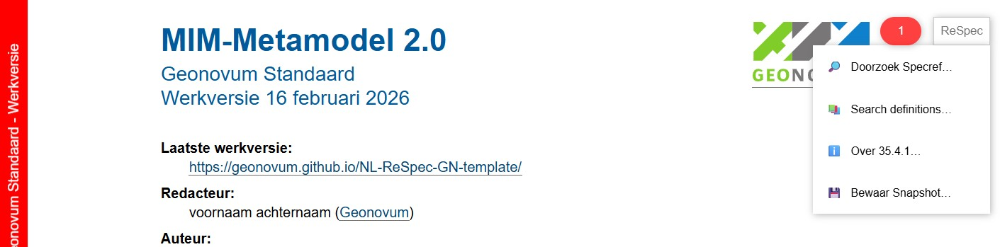

# Werkproces Creatie Begrippenmodel, Uitleg en Metamodel

## Incrementeel creatieproces

Bij het vervaardigen van het MIM 2.0 begrippenmodel, de uitleg daarvan en het bijbehorende Metamodel hanteren we het hieronder geïllustreerde incrementele creatieproces. Daarbij maken we gebruik van het daarvoor ingerichte Kanban bord met de in de illustratie genoemde kolommen:

1.	Backlog
2.	In progress 'Uitleg'
3.	In progress 'Begrippenmodel'
4.	In progress 'Metamodel'
5.	In review (PR’s)
6.	Done

Daar waar een blok een vervolg naar zowel een blauwe als een oranje route kent lopen deze parallel aan elkaar. Bijv. na het afronden van een issue dat in _"In progress 'Uitleg'"_ staat wordt de oranje route naar _"Is PR nodig?"_ EN de blauwe route naar _"Is het een Begrippenmodel issue?"_ doorlopen.
Is een PR noodzakelijk dan heb je dus 2 items: 
1. het originele issue en
2. de PR. 

Alleen PR’s komen in de 5e Kanban kolom ( _"In review (PR’s)"_ ), en er kunnen meerdere PR’s per issue zijn (elke keer als in een fase via het oranje pad de vraag _“Is PR nodig?”_ bevestigend wordt beantwoord). Per PR kan overigens maar één isue worden opgelost.

## Uitgebreide review

Het in de voorgaande paragraaf beschreven proces is gericht op het aanbrengen en reviewen van wijzigingen n.a.v. enkelvoudige issues.
Op gezette tijden zal er echter behoefte zijn aan een uitgebreide review op een volledig document. Zo’n review hoeft niet automatisch tot nieuwe issues te leiden. Wel kunnen er reviewopmerkingen worden geplaatst aan de hand waarvan bekeken moet worden of nieuwe issues noodzakelijk zijn of juist alleen een terugkoppeling aan de reviewer.

Van elk document dat we willen onderwerpen aan een uitgebreide review dient eerst een snapshot vervaardigd te worden. 

Onder een snapshot verstaan we een in de tijd bevroren status van een document met een naam waarin het tijdstip waarop het bevroren is opgenomen. De conventie daarvoor is [originele naam]-[yyyymmdd].[extensie]. 
In de regel zal het gaan om een markdown of html bestand maar in principe kan het ook enig ander formaat betreffen zolang dat maar te bekijken is in een webbrowser, bijv. een html of een text bestand, en het via een url te benaderen is.

> Van een Respec document kan een snapshot vervaardigd worden door het te openen en rechtsboven op de _'Respec'_ button te klikken en vervolgens te kiezen voor _'Bewaar Snapshot...'_.
>
> 

Dit document wordt geplaatst in een binnen de folder 'snapshot' aanwezige subfolder dat overeenkomt met het document. In de hieronder staande  (niet echt bestaande) structuur

zie je bijv. dat er voor zowel het metamodel zelf als voor het metamodel-begrippen en metamodel-uitleg snapshots zijn geplaatst. Voor het metamodel-uitleg zelfs al twee snapshots. Daarop heeft dus blijkbaar als eens een review plaats gevonden.

Het document 'snapshots/metamodel-uitleg/metamodel-uitleg-20260216.html' zou dan geöpend kunnen worden via de url https://geonovum.github.io/mim-metamodel/snapshots/metamodel-uitleg/metamodel-uitleg-20260216.

Deze url dient gedeeld te worden met de groep van personen waarvan verwacht wordt dat deze de review uitvoert. 

Deze personen maken, voor het uitvoeren van de review, gebruik van '[Hypothesis](https://web.hypothes.is/)'. 

> Hypothesis werkt in elke moderne web browser versie die gereleased is in de laatste 12 maanden. waaronder:
> 
> * Chrome
> * Firefox
> * Safari
> * Microsoft Edge
> * Opera
> * Vivaldi
> * Brave